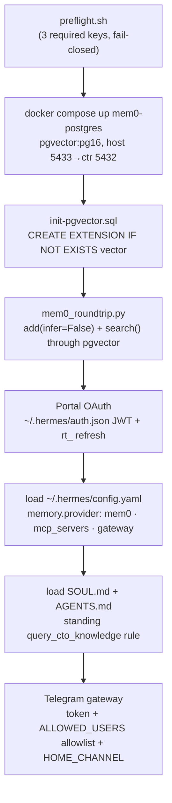

# Research: The Sovereign CTO Stack as built (Phases 0–5) and its deferred-backlog foundations

**Date**: 2026-06-27T14:45:00-07:00
**Git Commit**: `409fd3fdc8664982ea70d637d465bc6bb6c8e528`
**Branch**: `main`
**Repository**: `sovereign-cto-stack` (nested standalone repo at `sovereignCTO/`, gitignored by the `GS_AISafetyHackathon` parent; published at <https://github.com/dyrtyData/sovereign-cto-stack>)

> Note on citations: file paths below are relative to the `sovereignCTO/` repo root. Tracked
> files (everything under `scripts/`, `hermes/`, `rag/`, `recorder/`, `docs/`, `tickets/`, plus
> root config) can be permalinked at
> `https://github.com/dyrtyData/sovereign-cto-stack/blob/409fd3fdc8664982ea70d637d465bc6bb6c8e528/<path>`.
> Generated/local-only paths (`corpus/`, `graphify-out/`, `recordings/`, `workspaces/`, `~/.hermes/`)
> are gitignored and exist only on the host.

## Research Question

1. **Hermes orchestrator boot + memory + gateway (Phase 1).** How does Hermes boot end-to-end — Nous Portal inference, self-hosted mem0 as native memory provider (SDK-on-host against `mem0-postgres` pgvector on host port 5433) with `MEM0_API_KEY` Platform fallback, fact scoping by `user_id`/`agent_id`, and the gated Telegram gateway?
2. **CTO RAG brain and `query_cto_knowledge` (Phase 2).** How is the local Vector MCP sidecar built (MiniLM + LanceDB + FastMCP HTTP), how is the corpus converted/ingested, how is the tool bound to Hermes, and how is the "consult before every CTO function and cite the sources" instruction expressed?
3. **Tech-debt auditor hero loop (Phase 3).** The flow from graphify static map → `service_topology.py` (frontend=7 / checkout=6) → `cto-architecture` profile + `file_brownfield_ticket` skill → `linear_mcp.py` filed `[Brownfield]` ticket, the validation gates, cron scheduling, and the Online Boutique static-analysis target.
4. **PMF research profile + Kanban coordination (Phase 4 & P4).** How `cto-market` runs `pmf_brief` (web scrape + multi-angle grounding → cited brief → one `[Product]` ticket), the single-host Kanban handoff, and where real Stripe MRR/churn data would plug in.
5. **Autonomous-run recording pipeline + the progress ticker (Phase 4 + P0).** The Xvfb + ffmpeg x11grab capture, the split-screen panes, the scripted ticker, and — for P0 — what genuine Hermes session-log / tool-call artifacts exist.
6. **Egress / network posture and the Docker allow-list (P1).** Current network controls, how Hermes relates to the Docker Desktop LinuxKit VM, where a deny-by-default egress layer (NemoClaw/OpenShell) would attach, and the two macOS constraints.
7. **Skill/MCP integration contract + graphify→remediation surface (P2 & P3).** How skills declare/invoke MCP tools, how servers are registered, the graphify output schema SonarQube would layer onto, and the snapshot mechanism — plus external SonarQube/Codegen/Moderne capabilities.
8. **Visual / HTML surfaces (P0).** How `service-graph.html` is generated and styled, and the reusable self-contained-HTML pattern.
9. **Reproducibility, verification gates, and the self-perpetuating ticket workflow (Phases 0 & 5, Part D).** Public-safety machinery and the full-build ticket workflow end-to-end.

## Research Methodology (verbatim)

This document will remain objective and factual. It does not contain any recommendations or implementation suggestions.
Open questions will not ask Why things haven't been built or what should be built in the future.

There is no "implementation" section - that is intentional.

## Summary

The Sovereign CTO Stack is a **public-safe, version-controlled multi-agent "engineering factory"** that runs on an Apple Silicon host. Its core is a **Hermes** CLI orchestrator (Nous Portal inference) whose live runtime state lives in `~/.hermes/`; the repo's `hermes/` directory is a *tracked reference copy* that operators sync into `~/.hermes/` (a one-way repo→runtime relationship enforced by `cp` commands in the setup guide). Three Hermes profiles — `orchestrator`, `cto-architecture`, `cto-market` — share one Nous account and one SQLite Kanban board (`~/.hermes/kanban.db`). Persistent memory comes from the **mem0 SDK running on the host** (not a container) against a `pgvector/pgvector:pg16` container published on host port 5433, scoped by `user_id="sovereign-cto"` / `agent_id="orchestrator"`, with a `MEM0_API_KEY` Platform fallback that is currently inert (`mode: oss`).

A textbook-grounded **CTO RAG brain** (`rag/server.py`) is the system's defining behavioral primitive: a FastMCP HTTP sidecar that embeds 20+ converted engineering/growth textbooks with `all-MiniLM-L6-v2` into an embedded LanceDB index and exposes a single tool, `query_cto_knowledge(query, k)`, returning ranked chunks each carrying a `source_file` citation. A standing rule — declared redundantly in `hermes/SOUL.md`, `hermes/AGENTS.md`, and both profile `SOUL.md` files — obligates every agent to issue **multi-angle** `query_cto_knowledge` calls (one per dimension) before any CTO deliverable and to cite the *union* of returned `source_file`s. This grounding feeds two "hero" loops: the **tech-debt auditor** (graphify static-analyzes a never-deployed Online Boutique clone → `service_topology.py` derives the gRPC coupling map where `frontend=7` and `checkoutservice=6` → the `cto-architecture` profile grounds and files a `[Brownfield]` Linear ticket via the cloud Linear MCP), and the **PMF researcher** (`cto-market` scrapes the web, grounds against the corpus, writes a cited AARRR brief, and files one `[Product]` ticket). Every filed ticket is snapshotted into the git-tracked `tickets/<ID>.md` so git history — not an external tracker — is the authoritative decision record.

Autonomous runs are captured to `.mp4` by an **Xvfb + ffmpeg x11grab recorder sidecar**. Because x11grab records *pixels*, `record_run.sh` paints a split-screen onto virtual display `:99` (left: an `xterm` tailing an agent log; right: a Chromium showing `service-graph.html`), guards against blank/static frames, and finalizes the moov atom gracefully. The left pane is currently fed by a **scripted progress ticker** (a 2-second `printf` loop), *not* by real tool-call events — though genuine events do exist in `~/.hermes/logs/agent.log` (Python-logging lines like `agent.tool_executor: tool mcp_cto_knowledge_query_cto_knowledge completed (0.08s, 13555 chars)`); that gap is exactly what the P0 backlog item targets.

The repo is engineered to be clean-cloneable with zero committed secrets: a `.gitignore` that excludes `.env`/`corpus/`/`recordings/`/`.hermes/`, a fail-closed gitleaks `pre-commit` hook, a `preflight.sh` key gate, a `fresh_clone_smoke.sh` that proves the gate halts on placeholders and passes on stubs, a `check_doc_links.py` link validator, and `docker compose config -q`. The whole thing is self-perpetuating through `file_fullbuild_ticket.py`, which files the `[Full-Build]` epic (currently GLO-13) describing Parts A–D — the built phases, the prioritized P0–P4 backlog, remaining deferrals, and a "Part D" instruction to author the next epic (GLO-14) the same way Phase 5 authored GLO-13 — and auto-snapshots it via `snapshot_tickets.py`. The P0–P4 backlog items build on concrete existing surfaces: the recorder/agent-log split (P0), the Docker/LinuxKit boundary where a NemoClaw/OpenShell deny-by-default egress layer would attach (P1), the AARRR brief's web-grounded Revenue/Retention cells where Stripe data would slot in (P2/P4), and the `graphify-out/*.json` schema plus the MCP-server registration contract that a SonarQube REST client, Codegen MCP, or Moderne/OpenRewrite would extend (P2/P3).

## Detailed Findings

### 1. The repo's `hermes/` is a tracked reference; Hermes actually reads `~/.hermes/`

The single most important structural fact for understanding boot: **Hermes reads its runtime from `$HERMES_HOME` (default `~/.hermes/`), and the repo's `hermes/` directory is a version-controlled reference copy that must be synced there.** The relationship is one-way (repo → runtime) via explicit `cp` commands in `docs/setup-guide.md` — there is no symlink.

```text
repo/hermes/config.yaml   (61 lines, project-only keys)   ──cp──▶  ~/.hermes/config.yaml   (593 lines, full expanded runtime)
repo/hermes/SOUL.md                                        ──cp──▶  ~/.hermes/SOUL.md
repo/hermes/AGENTS.md                                      ──cp──▶  ~/.hermes/AGENTS.md
repo/hermes/mem0.json     (Hermes reads $HERMES_HOME/mem0.json)
repo/hermes/.env.example  (documents ~/.hermes/.env keys)  ──────▶  ~/.hermes/.env  (secrets, gitignored)
```

The reference `hermes/config.yaml:14-15` declares `provider: nous` / `model: Hermes-4-405B`; the live `~/.hermes/config.yaml:1-4` has overridden the model to `deepseek/deepseek-v4-pro` against `base_url: https://inference-api.nousresearch.com/v1`. `SOUL.md`/`AGENTS.md` are copied verbatim (a `~/.hermes/SOUL.md.bak.*` backup confirms a prior copy event). Profile SOULs sync the same way (`docs/setup-guide.md:277-280, 384-386`). Because the supervised Telegram gateway's working directory is locked to `~/.hermes` (not the repo), the standing rules are deliberately placed in `SOUL.md` (the always-loaded identity slot) so they fire in every surface (`hermes/SOUL.md:57-59`).

#### Testing patterns
There is no unit test of the sync itself; correctness is verified indirectly by `scripts/mem0_roundtrip.py` (memory) and by the behavioral assert scripts (tickets), all described below. The setup guide is the procedural source of truth.

### 2. Phase-1 boot: Portal OAuth → pgvector up → mem0 round-trip → config/SOUL load → Telegram gating

Hermes boots through a gated sequence. The programmatic gate is `scripts/preflight.sh`, which validates exactly three keys in the repo `.env` and halts (`exit 1`) on any missing/empty/placeholder value:

```bash
REQUIRED_KEYS=( NOUS_PORTAL_API_KEY  TELEGRAM_BOT_TOKEN  TELEGRAM_ALLOWED_USERS )   # preflight.sh:17-21
PLACEHOLDERS=( "sk-nous-xxxx…"  "123456789:ABCdef-…"  "123456789" )                  # preflight.sh:23-28
```

`MEM0_API_KEY` and `TELEGRAM_HOME_CHANNEL` are intentionally optional and not gated (`preflight.sh:15`).



**Inference auth has two coexisting paths.** The active path is OAuth: `hermes setup --portal` (a.k.a. `hermes portal login`) runs a device-code flow writing `~/.hermes/auth.json` (`active_provider: "nous"`, `scope: "inference:invoke"`, a ~15-minute `access_token`, and a durable `rt_`-prefixed `refresh_token`). The alternative is the static `NOUS_PORTAL_API_KEY` (`.env:4`, the OpenAI-compatible key) — preflight checks it regardless of which path is active. The live `~/.hermes/.env` contains no Portal key, confirming OAuth is active.

**mem0 runs as the SDK on the host.** There is no `mem0` container — only `mem0-postgres` (`docker-compose.yml:11-12` is explicit that the full OSS server + Next.js dashboard is deferred to the Phase-5 full-build ticket). Behavioral config lives in `hermes/mem0.json`:

```json
{ "mode": "oss", "user_id": "sovereign-cto", "agent_id": "orchestrator",
  "oss_config": {
    "vector_store": { "provider": "pgvector",
      "config": { "host": "127.0.0.1", "port": 5433, "user": "mem0", "password": "mem0",
                  "dbname": "vector_store", "collection_name": "memories",
                  "embedding_model_dims": 384 } },
    "embedder": { "provider": "huggingface",
      "config": { "model": "sentence-transformers/all-MiniLM-L6-v2" } },
    "llm": { "provider": "ollama",
      "config": { "model": "qwen2.5-coder:14b", "ollama_base_url": "http://localhost:11434" } } },
  "platform_fallback": { "mode": "platform" } }   // inert until mode → "platform"; reads MEM0_API_KEY
```

(`hermes/mem0.json:1-39`). Facts are scoped by `user_id`/`agent_id` (lines 4-5), used as filter metadata on every `add()`/`search()`. The `mem0-postgres` service publishes `${MEM0_PG_HOST_PORT:-5433}:5432` and auto-runs `scripts/init-pgvector.sql` (a single `CREATE EXTENSION IF NOT EXISTS vector;`) on first init (`docker-compose.yml:15-35`).

**Telegram gating** is driven by three env vars read from `~/.hermes/.env`, with the gateway enabled in config (`hermes/config.yaml:23-26`):

| Env var | Role |
|---|---|
| `TELEGRAM_BOT_TOKEN` | Authenticates the bot to Telegram's API (from @BotFather) |
| `TELEGRAM_ALLOWED_USERS` | Comma-separated numeric allowlist (from @userinfobot); other IDs rejected |
| `TELEGRAM_HOME_CHANNEL` | Optional delivery target for cron output |

#### Testing patterns
`scripts/mem0_roundtrip.py` is the Phase-1 smoke test (exit-0-on-pass, usable as a CI gate). It uses `uv run` inline deps (`mem0ai`, `sentence-transformers`, `vecs`, `psycopg2-binary`, `ollama`), connects to `127.0.0.1:5433` with the `mem0.json`-matching defaults, writes a fact with `infer=False` (no LLM needed) under an isolated `user_id="sovereign-cto-roundtrip"` and an ephemeral `collection_name=f"roundtrip_{uuid…}"`, then `search()`es it back asserting a non-null score and loose text containment (`mem0_roundtrip.py:35-118`).

### 3. The CTO RAG brain: one tool, MiniLM + LanceDB + FastMCP, every result cites its `source_file`

`rag/server.py` is a self-contained FastMCP sidecar exposing exactly one MCP tool. Its contract:

```python
@mcp.tool
def query_cto_knowledge(query: str, k: int = DEFAULT_K) -> str:   # server.py:259, DEFAULT_K=5
    # → JSON string: { "query": <str>,
    #   "results": [ { "source_file": "...md", "heading": "...", "score": 0.84, "text": "..." }, … ] }
```

Returns are ranked best-first by cosine similarity (`score = 1.0 - distance`, `server.py:224-225`). The docstring (`server.py:260-271`) tells the agent to consult it before every CTO function and cite `source_file`. To Hermes it is namespaced `mcp_cto_knowledge_query_cto_knowledge`.

Pipeline:

```text
corpus/*.md  ──chunk_markdown──▶  LanceDB table "cto_knowledge"  ──query──▶  query_cto_knowledge
  heading-aware split (regex ^#{1,6})        schema: vector list<float32,384>,
  → window 1200 chars / 150 overlap            text, source_file, heading, chunk_index
  → drop fragments <40 chars                 (table dropped+rebuilt on ingest — idempotent)
```

- **Embeddings:** `sentence-transformers/all-MiniLM-L6-v2`, 384-dim, L2-normalized; lazy `@lru_cache` load; baked into the Docker image at build time so no network at runtime (`server.py:64-86`, `rag/Dockerfile:20,27-28`).
- **Index:** embedded LanceDB at `/data` in-container (named volume `rag-index`) or `rag/.lancedb/` locally; PyArrow schema at `server.py:186-194`; dropped+recreated on every ingest (`server.py:196-198`).
- **Chunking:** two-pass — heading split then fixed 1200-char windows with 150 overlap (`server.py:101-147`).
- **HTTP transport:** FastMCP Streamable HTTP on `0.0.0.0:8080`, MCP at `/mcp` (`server.py:334`). Extra custom routes: `GET /health` (`{status, chunks, sources}`), `POST /search`, `POST /ingest` (`server.py:290-309`).
- **Dependencies:** `fastmcp>=3,<4`, `lancedb>=0.13`, `sentence-transformers>=3,<6`, `pyarrow>=15` (`rag/requirements.txt`, mirrored as PEP-723 inline metadata).

**Corpus conversion** (`scripts/convert_corpus.sh`) runs two passes over `~/Downloads/UTM-shared/{Growth,System Design,Org Design}`: a **docling** pass for PDFs (Apple **MPS** acceleration, `num_threads=8`, OCR off, table-structure on; per-PDF isolation via `uv run --with docling`) then a **pandoc** pass for EPUBs (`-f epub -t gfm`). A `slugify()` dedupe makes the PDF win when both formats exist; a completeness check exits 1 if any title is missing (`convert_corpus.sh:38-194`). The corpus is ~20 books (Building Microservices, DDIA, Team Topologies, Managing Technical Debt, Hacking Growth, The Lean Product Playbook, Accelerate, etc.); `corpus/` is gitignored.

**MCP binding** in `hermes/config.yaml:52-57`:

```yaml
mcp_servers:
  cto_knowledge:
    url: "http://localhost:8080/mcp"
    tools: { include: [query_cto_knowledge] }   # allowlist
    timeout: 60
```

**The standing instruction** is expressed in three overlapping layers, all loaded from `~/.hermes`: the orchestrator `SOUL.md:28-59` (multi-angle: one query per dimension, cite the *union* of `source_file`s), `AGENTS.md:9-25` Rule #1 (with the exact call/response shape and a function→texts table), and each specialist profile's own `SOUL.md` re-declaring it with profile-specific angles (architecture: coupling / tech-debt economics / decomposition / delivery; market: problem-solution fit / market sizing / experimentation / growth loops).

#### Testing patterns
`scripts/rag_smoke.py` (exit-0-on-pass) makes three assertions against a running sidecar: `GET /health` reports `chunks > 0`; `POST /search {"query":"microservices coupling","k":5}` returns ≥1 result whose top hit has a non-empty `source_file` and numeric `score`; and a *grounding-integrity probe* — at least one returned `source_file` must contain one of `{microservices, coupling, architecture, hard-parts, balancing}` (`rag_smoke.py:39-77`). The compose `rag-sidecar` healthcheck polls `/health` (`docker-compose.yml:54-60`).

### 4. The tech-debt hero loop: graphify → `frontend=7`/`checkout=6` coupling → grounded `[Brownfield]` ticket

The loop is a five-step pipeline against a **static-analysis-only** clone of Google's Online Boutique (`microservices-demo`), which is K8s-only upstream and is *never deployed* (`hermes/AGENTS.md:47-49` Rule #4; the clone lives in gitignored `workspaces/`).

```text
run_graphify.sh
  ├─ git clone --depth 1 microservices-demo → workspaces/        [run_graphify.sh:51]
  ├─ prune static/, node_modules/, *.md/*.png/*.html …           [:65-70]  (lets graphify run offline, no LLM key)
  ├─ graphify extract src/ --out REPO_ROOT --no-cluster          [:88]  → graphify-out/graph.json (2513 nodes, 4290 edges)
  │                                                                       → graphify-out/manifest.json (per-file ast/semantic hash)
  ├─ graphify cluster-only REPO_ROOT --no-label                  [:106] → GRAPH_REPORT.md + graph.html (197 communities)
  ├─ service_topology.py --src src/ --out service-coupling.json  [:119-120]
  └─ render_service_graph.py --in … --out service-graph.html     [:128-129]
```

**The headline coupling signal** is derived by `scripts/service_topology.py`, not by graphify. For each `src/<service>/` directory it concatenates all code files, treats the service as a gRPC client only if the source contains one of eight dial idioms (`CONN_HINTS` — `mustConnGRPC`, `grpc.Dial`, `grpc.NewClient`, `insecure_channel`, `GrpcChannel`, `ManagedChannelBuilder`, `createClient`, `credentials.createInsecure`; `service_topology.py:65-74`), finds every `NAME_SERVICE_ADDR` reference via regex, maps the prefix to a target service via `ENV_TO_SERVICE` (`:42-52`), excludes `COLLECTOR` and `SHOPPING_ASSISTANT` (`:54-59`), dedups and drops self-loops, then ranks by outbound degree (`:112-162`). The result:

```json
"outbound_degree": { "frontend": 7, "checkoutservice": 6, "recommendationservice": 1 },
"hubs": [ {"service":"frontend","outbound_degree":7}, {"service":"checkoutservice","outbound_degree":6}, … ]
```

Each edge carries `{source, target, relation:"grpc", evidence_file}` where `evidence_file` prefers `main.go`/`main.py`/`server.js` (`service_topology.py:94-109`) — that path is exactly what the ticket skill must name.

**The agent run** (cron, or `record_run.sh:188-191`): `hermes -p cto-architecture -z "…read service-coupling.json, find the highest-degree hub, ground via MULTIPLE query_cto_knowledge calls (one per dimension), cite the UNION, file ONE [Brownfield] ticket…" --skills file_brownfield_ticket --yolo`. The profile `SOUL.md` makes multi-angle grounding "NON-NEGOTIABLE" (`cto-architecture/SOUL.md:20-55`).

**The skill** `hermes/skills/file_brownfield_ticket.md` is an instruction doc (YAML frontmatter + Markdown body), not code. It mandates four minimum `query_cto_knowledge` calls (coupling / tech-debt interest / decomposition / delivery) and specifies the `save_issue` field shape: `title` starts with `[Brownfield]`, `team="Global South Ai Safety"`, `labels=["Brownfield"]`, `priority=2`, and a `description` with sections Finding / Concrete files (≥1 `src/<service>/` path) / Why it matters / Proposed refactor / `Grounded in: <source_file>` lines / Acceptance criteria (`file_brownfield_ticket.md:44-76`). After filing it reads the ticket back and runs `snapshot_tickets.py` (`:125-139`).

**Ticket mechanics** go through `scripts/linear_mcp.py` (used by the verification scripts; the agent uses Hermes' own Linear MCP binding). It is a stdlib-only Streamable-HTTP JSON-RPC 2.0 client to `https://mcp.linear.app/mcp`, resolving the OAuth token from `$LINEAR_MCP_TOKEN` → `~/.hermes/profiles/cto-architecture/mcp-tokens/linear.json` → `~/.hermes/mcp-tokens/linear.json`, doing the `initialize`+`notifications/initialized` handshake (`protocolVersion 2025-06-18`), persisting `Mcp-Session-Id`, unwrapping SSE `data:` frames, and exposing `L.init()` / `L.tool(name, args)` (`linear_mcp.py:26-103`).

**Cron** is configured via the Hermes CLI (`docs/setup-guide.md:343-354`): `hermes -p cto-architecture cron create "0 9 * * *" "…" --skill file_brownfield_ticket --deliver telegram`, persisted to `~/.hermes/profiles/cto-architecture/cron/jobs.json`, firing only when that profile's gateway runs.

#### Testing patterns
Two gates. `scripts/assert_graph_topology.py` checks `graph.json` has nodes, `GRAPH_REPORT.md`/`graph.html` are non-empty, and `service-coupling.json` matches `EXPECTED = {"frontend": 7, "checkoutservice": 6}` (`:18,21-57`). `scripts/assert_brownfield_ticket.py` fetches the newest `[Brownfield]` ticket over the Linear MCP and asserts five things: `[Brownfield]` title prefix, `brownfield` label, a `src/<service>/` path in the body, a `Grounded in: …*.md` citation, and multi-angle grounding (`REQUIRED_SOURCES = {managing-technical-debt.md, software-architecture.md}` both present, ≥4 distinct `*.md` sources) (`:30-36,50-110`).

### 5. The PMF loop: web scrape + multi-angle grounding → cited AARRR brief → one `[Product]` ticket, coordinated over a single-host Kanban

The `cto-market` profile (`hermes/profiles/cto-market/SOUL.md`) runs five ordered behaviors: web scrape → mandatory multi-angle RAG grounding → emit brief via `pmf_brief` skill → file ONE `[Product]` ticket → hand off via `kanban_complete()`. The `pmf_brief` skill mandates four query angles (problem-solution fit, market sizing, experimentation/validated learning, growth loops) and a six-section brief written to `recordings/pmf_brief_run_<ts>.md`: Question & target customer / Market signal (web, with URLs) / Framework analysis / `Grounded in:` (one literal line per cited corpus text) / Recommendation / Riskiest assumption to test next (`pmf_brief.md:19-110`).

**AARRR grounding today:** the AARRR framework (Acquisition/Activation/Retention/Referral/Revenue) appears explicitly in the earliest brief (`recordings/pmf_brief_run_20260626_231101.md:131`, attributed to `the-lean-product-playbook.md`) and is folded into growth/market paragraphs in later briefs. Critically, **the Revenue/Retention/Referral cells are grounded only in web-scraped competitor pricing/market reports** (e.g. "$20–$600/user/month" from a vendor page) — no Stripe data appears in any brief. `docs/system-design-tradeoffs.md:328-330` states the deferred P2 Stripe integration's primary purpose is to *ground the AARRR Revenue/Retention in real MRR/churn/cohorts vs. assumptions* — that is the precise plug-in point.

**The single-host Kanban** is `~/.hermes/kanban.db` (SQLite), shared by all three profiles *because they run on one host* (design Q4; cross-host coordination is explicitly unimplemented, `system-design-tradeoffs.md:74`). `scripts/pmf_kanban_run.sh` drives the lifecycle:

```text
hermes kanban create  → tasks.status = ready    + task_events.kind = created
hermes kanban claim   → tasks.status = running  + task_events.kind = claimed
        (agent runs; brief written; handoff fields extracted by inline Python)
hermes kanban complete → tasks.status = done     + task_events.kind = completed
                         task_runs row: status=done, outcome=completed, summary=<str>, metadata=<JSON>
```

`kanban_complete()` returns `summary` (one-line) + `metadata` JSON `{artifact, grounded_in[], recommendation}` (`pmf_kanban_run.sh:144-161`; `riskiest_assumption` is an optional key the skill names but the run script omits). The script supports `NO_AGENT=1` (writes a deterministic stub brief but still exercises the full Kanban lifecycle + citation artifact). The last task id is written to `recordings/.last_pmf_task_id` (currently `t_bbf6b001`).

#### Testing patterns
`scripts/assert_pmf_run.py` does two checks: **brief** (file exists; `Grounded in: …*.md` matches; ≥1 cited file exists under `corpus/`, or citation-string presence alone suffices on a clean clone) and **kanban** (opens `kanban.db` read-only; `tasks.status='done'`; `task_events` contains `created→claimed→completed` *in order*; a `task_runs` row has `status='done'`, `outcome in (None,'completed')`, non-empty `summary` and `metadata`) (`:58-150`). `scripts/assert_product_ticket.py` validates the `[Product]` ticket over the Linear MCP: `Product` label or `[Product]` title; a capability-gap word (`GAP_RE`); an `https://` market URL; and a `Grounded in: *.md` citation (`:84-134`).

### 6. The recorder paints pixels onto `:99`; the left pane runs a scripted ticker, not real tool-call events

Because ffmpeg x11grab records *pixels*, the recorder must paint a visible surface before capture. The recorder sidecar (`recorder/Dockerfile`, `debian:bookworm-slim`) bundles Xvfb, ffmpeg, fluxbox WM, Chromium, xterm, wmctrl, and fonts; it runs `idle` (Xvfb + `tail -f /dev/null`) so the host can drive it via `docker exec` (`recorder/entrypoint.sh:223-248`).

`scripts/record_run.sh` orchestrates from the host:

```text
create empty recordings/agent_<job>_<ts>.log   (bind-mounted into container at /recordings/…)
  ▼
docker compose --profile record up -d recorder ; poll xdpyinfo :99
  ▼
rexec surface-split <agent_log> /graphify-out/service-graph.html "tech-debt audit"
     └ container launch_split:  xterm  -e "tail -n +1 -f <log>"   (LEFT pane, geometry pinned via wmctrl)
                                chromium <service-graph.html>      (RIGHT pane)
  ▼
rexec has-window           (non-blank guard — abort code 3 if no mapped window)
  ▼
rexec start run_<job>_<ts>.mp4
     └ ffmpeg -f x11grab -framerate 15 -video_size 1280x720 -i :99 -vcodec libx264 -crf 24 -movflags +faststart  < /tmp/ff_in
  ▼
start_ticker "tech-debt audit"                 (background: printf a line every 2s into the agent log)
hermes -p cto-architecture -z "…" | stdbuf -oL -eL tee -a <agent_log>   (real output appended in one burst at the end — -z buffers)
stop_ticker
  ▼
rexec stop                 (printf 'q\n' > /tmp/ff_in → graceful moov; SIGINT fallback)
  ▼
verify_recording.py run_<job>_<ts>.mp4  ;  snapshot_after_run.sh
```

**The ticker** (`record_run.sh:156-166`) is a subshell loop appending one plain-text line every 2 s:

```text
[11:18:56] tech-debt audit in progress … (tick 1) — grounding via query_cto_knowledge, surface live
```

It mentions `query_cto_knowledge` as a fixed string but reflects no actual tool calls. Because `hermes -z` (one-shot) buffers its answer until completion, the left pane would otherwise sit still during inference; the ticker keeps it visibly non-static. The real agent output floods in at the end via `stream()` (`stdbuf -oL -eL tee`).

**Genuine tool-call artifacts (the P0 target) exist — but elsewhere.** Hermes writes real events to `~/.hermes/logs/agent.log` (Python `logging` format). A genuine RAG tool-call completion line:

```text
2026-06-26 21:36:32,908 INFO [20260626_204349_853e1728] agent.tool_executor: tool mcp_cto_knowledge_query_cto_knowledge completed (0.08s, 13555 chars)
```

Fields: timestamp, level, `[session_id]`, logger (`agent.tool_executor`), and `tool <name> completed (<dur>s, <chars> chars)` (or `returned error`). `agent.conversation_loop` lines record API calls and turn ends. Observations for P0: (a) the recordings/ `*.log` files contain only ticker lines + the final buffered agent summary (and PMF logs end with a JSON summary including `filed_ticket.id`), never per-tool-call events; (b) `~/.hermes/logs/agent.log` is a single appended combined log (no per-session JSONL files; session content lives in `~/.hermes/state.db`); (c) profile-specific logs (`~/.hermes/profiles/*/logs/agent.log`) hold only plugin/MCP-connection messages — the `agent.tool_executor` events land in the orchestrator log even under `-p cto-architecture`; (d) the gap is that the container's `recordings/` bind-mount does not expose `~/.hermes/logs/`, so the xterm tails the ticker file, not the real log.

#### Testing patterns
`scripts/verify_recording.py` runs five ffprobe/ffmpeg checks: valid mp4/mov container with a video stream; `duration > 0`; moov atom present; **non-blank** mid-run frame (signalstats `YSTDEV ≥ 3.0`, or luma range `≥ 24`); and **non-static** (blend-difference `YAVG ≥ 1.0` between frames at 0.25 and 0.75 of duration) (`verify_recording.py:64-160`). One older run log (`record_hero_20260626_231540.log`) shows only 4 PASS lines, indicating the non-static check was added after that recording.

### 7. The skill/MCP contract and the graphify schema are the extension points for P2/P3

**Skills declare via YAML frontmatter and invoke MCP tools inline as prose function-calls.** Both skill files open with `--- name: … description: … ---` (the only frontmatter keys) and then reference tools by name in code-styled prose, e.g. `query_cto_knowledge(query="…", k=5)`, `save_issue(...)`, `list_issues(...)`, `kanban_complete(...)`. There is no separate `tools:` block in a skill; the field-shape documentation lives in the skill body (e.g. `file_brownfield_ticket.md:48` notes the server's `team`/`labels` are human-readable forms of GraphQL `teamId`/`labelIds`), and skills cross-reference each other (`pmf_brief.md:134-135` reuses the `save_issue` shape).

**MCP servers are registered in `hermes/config.yaml` under `mcp_servers`** with a simple per-server schema — this is the contract a Stripe MCP or SonarQube client would follow:

```yaml
mcp_servers:
  <name>:
    url: "<streamable-http endpoint>"     # required
    tools: { include: [<tool>, …] }       # optional allowlist (omit = expose all)
    timeout: <seconds>                     # optional
    auth: oauth                            # only if OAuth (token at ~/.hermes/[profiles/*/]mcp-tokens/<name>.json)
```

`scripts/linear_mcp.py` is the reusable reference client (stdlib-only Streamable-HTTP JSON-RPC; token resolution, `initialize`/`initialized` handshake, session-id persistence, SSE unwrap, `L.tool()`).

**The graphify output schema** is the surface SonarQube signals would layer onto:

| File | Shape | Role |
|---|---|---|
| `graph.json` | NetworkX node-link JSON; nodes carry `label,file_type,source_file,source_location,_origin:"ast",id,community,community_name,norm_label`; 2513 nodes / 4290 edges | Raw AST symbol/file graph |
| `manifest.json` | `{ "<svc>/<path>": {mtime, ast_hash, semantic_hash} }` | Per-file incremental cache index |
| `service-coupling.json` | `{target, services[], outbound{}, outbound_degree{}, edges[{source,target,relation:"grpc",evidence_file}], hubs[]}` | Derived service topology (the ticket's input) |
| `GRAPH_REPORT.md` | Obsidian-wikilink report: stats, god nodes, surprising/inferred connections, per-community cohesion, knowledge gaps | Human-readable summary |

The JSON objects have no schema validation, so an external signal can add top-level keys (e.g. `static_analysis`) or new edge `relation` types. See §9 (external capabilities) for SonarQube/Codegen/Moderne specifics.

#### Testing patterns
All four assert scripts (`assert_graph_topology`, `assert_brownfield_ticket`, `assert_product_ticket`, `assert_pmf_run`) import `linear_mcp` and exercise the same `L.init()`/`L.tool()` path; topology assertions read `graphify-out/*.json` directly.

### 8. `service-graph.html` is a single self-contained vis-network file rendered by f-string templating

`scripts/render_service_graph.py` generates `graphify-out/service-graph.html` from `service-coupling.json` using a module-level Python f-string/`str.format()` template (`HTML`, `render_service_graph.py:92-137`) with four placeholders `{cdn}`, `{target}`, `{nodes}`, `{edges}` (literal CSS/JS braces escaped as `{{ }}`). `json.dumps(nodes/edges)` is inlined directly into a `vis.DataSet([...])` call (`:155-159`). The only external dependency is **vis-network 9.1.9** from a CDN `<script>`; no build step, no server, ~46 lines, ~9 KB.

Node styling is degree-tiered (`_node_style()`, `:34-65`):

| Tier | Condition | Fill | Font | Size |
|---|---|---|---|---|
| Hub | `degree ≥ 4` | `#e8543f` red | 22px bold white | `18 + degree*7` |
| Intermediate | `degree > 0` | `#f0b429` amber | 16px | `18 + degree*7` |
| Leaf | `degree == 0` | `#8aa0b6` steel | 14px | 18 |

All nodes `shape:"dot"` with a dark stroke halo (`strokeColor:#0f1721`); hub edges are heavier/red, others thin/blue; arrows `"to"`, curved smoothing; barnesHut physics (`:127-129`). The page CSS is a dark palette (`#0f1721` bg, `#e7eef6` text) filling the viewport (`#net { height: calc(100% - 96px) }`). By contrast `graphify-out/graph.html` (from `graphify cluster-only`) is the larger 2513-node interactive graph with a sidebar (search, node info, community legend, stats) and vis-network 9.1.6. The recorder mounts `./graphify-out:/graphify-out:ro` (`docker-compose.yml:84-87`) so Chromium can open the file by path.

#### Testing patterns
No dedicated test renders/validates the HTML; `assert_graph_topology.py` only checks `graph.html` is non-empty. `service-graph.html` itself is exercised indirectly by `verify_recording.py` (it is the painted right-pane surface whose pixels must be non-blank).

### 9. P0–P4 backlog foundations: what each item builds on, including external capabilities (P1/P2/P3)

The deferred backlog (Part B of the full-build ticket) maps to concrete existing surfaces:

- **P0 — demo authenticity:** swap the scripted ticker (§6) for real `~/.hermes/logs/agent.log` `agent.tool_executor` events; the recorder/agent-log split and the self-contained-HTML pattern (§8) are the surfaces to render onto.
- **P1 — deny-by-default egress (NemoClaw/OpenShell):** attaches at the Docker boundary (§ below).
- **P2 — Stripe:** grounds the AARRR Revenue/Retention cells (§5) and would register as a new Stripe MCP under the `mcp_servers` contract (§7).
- **P3 — SonarQube + graphify(KEEP) → Hermes judgment → Codegen/Moderne remediation:** SonarQube signals layer onto `service-coupling.json`/`graph.json` (§7); GLO-12 independently proposed this gap.
- **P4 — full PMF loop (RICE/ICE ranked):** extends the §5 brief→ticket flow.

**P1 — NemoClaw/OpenShell.** Today the stack has no deny-by-default egress: compose publishes ports (5433, 8080) and binds volumes, but outbound calls (Nous inference, Linear MCP, Telegram, web scrape) are unrestricted. Hermes runs on the macOS host; containers run inside the **Docker Desktop LinuxKit VM** (security primitives like Landlock/seccomp exist only in that VM's kernel, not on macOS; `localhost` in a container is the container, the host is `host.docker.internal`). **NemoClaw** (NVIDIA, Apache-2.0, GTC 2026) wraps agents in **OpenShell** sandboxes enforcing five layers, the relevant one being deny-by-default egress via an embedded **OPA CONNECT proxy** evaluating Rego rules, configured through `policy.yaml` (`filesystem_policy` via Landlock; `network_policies` with named blocks requiring *both* a matching binary and endpoint; hot-reloadable). The two noted macOS constraints are real: (a) **Landlock `best_effort`** probes the kernel ABI and silently degrades if unsupported — Docker Desktop's LinuxKit only enabled the Landlock LSM in **4.60.0 (Feb 2026)**, and OpenShell issue #803 documents `best_effort` silently returning `Ok()` (unconfined) due to a privilege-ordering bug; (b) **`inference.local` mDNS** `.local` resolution does not work inside Docker containers (no avahi in LinuxKit; the OPA proxy also validates DNS against approved domains), so a local Ollama endpoint must use an explicit IP/real hostname.

**P2/P3 — external remediation APIs.**
- **SonarQube Web API** (Bearer token): `GET /api/issues/search` (params `componentKeys`, `impactSeverities`, `types`, `statuses`, `facets`, `p/ps`; returns `{total, paging, issues[{key, component, rule, severity, message, status, type, line, …}]}`) and `GET /api/measures/component` (params `component`, `metricKeys=ncloc,code_smells,complexity,coverage,bugs,…`; returns `{component:{key, qualifier, measures[{metric, value, bestValue}]}}`).
- **Codegen MCP** (`mcp.codegen.com` / built into the Codegen CLI): exposes Codegen's agentic SWE backend over stdio or HTTP (trigger multi-file refactors, test generation, manage agent runs); auto-discovers tools; supports Claude/Cline/Cursor.
- **Moderne / OpenRewrite:** OpenRewrite is the OSS recipe engine (parses code to **Lossless Semantic Trees**, applies composable Visitor **Recipes**, 3000+ recipes, format-preserving). Moderne is the commercial at-scale platform (centralized cached LSTs across many repos) and ships a **local MCP server** (`mod config agent-tools install`) exposing indexed search (`trigrep_search`), semantic navigation (`find_types`/`find_methods`), code editing (`change_type`/`pattern_replace`), recipe integration (`search_recipes`/`run_recipe`/`query_datatable`), and status tools. Source links are listed in Code References.

### 10. The repo is clean-cloneable and self-perpetuating: gates + the `[Full-Build]` epic workflow

**Public-safety machinery.** The `.gitignore` excludes secrets (`.env*`), `corpus/`, `recordings/`, `graphify-out/`, `workspaces/`, `.hermes/`, all `*.db`, and `.lancedb/`; it tracks `scripts/`, `docs/`, `hermes/` config, `rag/` source, `tickets/`, `.env.example`, `.githooks/pre-commit`, and root config. `tickets/` is deliberately tracked (non-secret) so git is the decision record. The **`.githooks/pre-commit`** hook fails *closed*: if `gitleaks` is absent it `exit 1`s, then runs `gitleaks protect --staged --no-banner` and blocks on any finding; it must be activated per clone with `git config core.hooksPath .githooks`.

The verification gates:

| Gate | Command | Fires |
|---|---|---|
| No staged secrets | `.githooks/pre-commit` (gitleaks protect --staged) | every commit (auto) |
| Required keys present | `scripts/preflight.sh` | Phase 0 |
| Compose valid | `docker compose config -q` | Phase 0 |
| Clean-clone halts+passes | `scripts/fresh_clone_smoke.sh` | Phase 5 |
| Doc links resolve | `scripts/check_doc_links.py` | Phase 5 |
| Full-build ticket structure | `scripts/assert_fullbuild_ticket.py` | Phase 5 |
| Full-repo secret scan | `gitleaks detect` | Phase 5 |

`fresh_clone_smoke.sh` materializes a throwaway clone (`git archive HEAD | tar -x`, or `CLONE=1` for a real clone), asserts `.env.example`/`preflight.sh` present and `.env` absent, then proves the gate *halts* on placeholder keys and *passes* on non-secret test stubs (`:30-69`). `check_doc_links.py` regex-scans `docs/**.md` + `README.md`, skips external/anchor links, resolves relative paths (allowing `is_dir()` for gitignored-but-expected dirs like `corpus/`) (`:30-59`). `docker compose config -q` is a pure config-parse gate (no containers, exit code only).

**The self-perpetuating ticket workflow.** `scripts/file_fullbuild_ticket.py` holds a `TITLE` constant and a four-part `DESCRIPTION` (Part A built phases; Part B prioritized P0–P4 backlog; Part C remaining deferrals — mem0 OSS server/Next.js dashboard, OpenHands, second-account walkthrough; **Part D** "author the next epic" — when Part B is substantially actioned, author GLO-14 mirroring how Phase 5 authored GLO-13, and snapshot it). It is idempotent: an id arg, `$FULLBUILD_ID`, or `find_existing()` (`list_issues query="[Full-Build]"`) decides create-vs-update, then calls `save_issue(title, team, labels=["Full-Build"], priority=2, description, [id])` and immediately `subprocess.run([… snapshot_tickets.py, ident])` (`:211-247`).

`scripts/snapshot_tickets.py` is the persistence mechanism: for each id it `get_issue`, `render()`s a Markdown doc (`# <ID> — <title>`, metadata bullets incl. an ISO `snapshot captured` timestamp, then `## Description` with the full body), and writes `tickets/<ID>.md` (overwrite-idempotent; does *not* commit) (`:74-124`). `snapshot_after_run.sh` discovers `[Brownfield]`+`[Product]` ids (not `[Full-Build]`) and delegates. Filing GLO-14 is thus reproduced by editing the `DESCRIPTION` constant, running the script, and committing the new `tickets/GLO-14.md`. The three `docs/` files are the living record: `setup-guide.md` (repeatable clean-clone walkthrough incl. the `~/.hermes` `cp` syncs), `system-design-tradeoffs.md` (the Q1–Q8b cited decision record + deferred-work P1–P4 mapping), and `cto-functions.md` (each CTO function → queried dimensions → corpus slugs, with the factory-loop diagram putting `query_cto_knowledge` first).

#### Testing patterns
`scripts/assert_fullbuild_ticket.py` fetches the `[Full-Build]` ticket and runs nine structural checks against its description: `[Full-Build]` title; all of Phase 0–5; `P1 — NemoClaw` + `policy.yaml`; `P2 — Stripe` + `MRR`; `P3 — SonarQube` + `graphify (KEEP IT)` + `JUDGMENT` + `Codegen` + `Moderne`; `GLO-12`; `P4 — PMF` + `RICE/ICE`; remaining-deferral keywords; and a `full-build` label (`:66-81`). Existing snapshots (`tickets/GLO-8`…`GLO-13.md`) confirm the rendered shape.

## Code References

> Tracked files are permalinkable at `…/blob/409fd3f…/<path>`. Lists are near-exhaustive for the tracked `scripts/`, `hermes/`, `rag/`, `recorder/` areas; generated dirs are listed as directories.

### Hermes orchestrator (Phase 1)
- `hermes/config.yaml:14-15,23-26,52-61` — provider/model, Telegram gateway enable, `mcp_servers` block
- `hermes/SOUL.md:28-59` — orchestrator identity + standing multi-angle query rule
- `hermes/AGENTS.md:9-25,47-49` — project rules (Rule #1 grounding, Rule #4 static-analysis-only)
- `hermes/mem0.json:1-39` — mem0 OSS config, `user_id`/`agent_id` scoping, Platform fallback
- `hermes/.env.example` — `~/.hermes/.env` key template
- `scripts/preflight.sh:13-77` — required-key gate
- `scripts/mem0_roundtrip.py:35-118` — Phase-1 memory smoke test
- `scripts/init-pgvector.sql` — `CREATE EXTENSION IF NOT EXISTS vector`
- `docker-compose.yml:15-35` — `mem0-postgres` service
- `~/.hermes/` (host-only) — live config, `auth.json`, `kanban.db`, `logs/agent.log`, `state.db`, `mcp-tokens/`

### CTO RAG brain (Phase 2)
- `rag/server.py:34-334` — full sidecar (embed `:64-86`, chunk `:101-147`, schema `:186-198`, search `:219-225`, tool `:259-288`, routes `:290-309`, run `:334`)
- `rag/Dockerfile:9-38`, `rag/requirements.txt`, `rag/README.md`
- `scripts/convert_corpus.sh:38-194` — docling PDF + pandoc EPUB conversion
- `scripts/rag_smoke.py:39-77` — RAG smoke test
- `corpus/` (gitignored) — ~20 converted textbooks
- `hermes/profiles/cto-architecture/SOUL.md`, `hermes/profiles/cto-market/SOUL.md` — standing-rule re-declarations

### Tech-debt auditor loop (Phase 3)
- `scripts/run_graphify.sh:46-129` — clone/prune/extract/cluster/topology/render pipeline
- `scripts/service_topology.py:42-162` — coupling derivation (`ENV_TO_SERVICE`, `CONN_HINTS`, `derive()`)
- `scripts/render_service_graph.py:34-159` — `service-graph.html` generator
- `hermes/skills/file_brownfield_ticket.md:15-139` — skill (preconditions, field shape, post-filing)
- `scripts/linear_mcp.py:26-103` — reference Linear MCP client
- `scripts/assert_graph_topology.py:18-57`, `scripts/assert_brownfield_ticket.py:30-110` — gates
- `graphify-out/` (gitignored) — `graph.json`, `service-coupling.json`, `GRAPH_REPORT.md`, `graph.html`, `service-graph.html`, `manifest.json`
- `workspaces/microservices-demo/` (gitignored) — Online Boutique static-analysis target

### PMF + Kanban (Phase 4)
- `hermes/profiles/cto-market/SOUL.md`, `hermes/skills/pmf_brief.md:19-211` — profile + skill
- `scripts/pmf_kanban_run.sh:38-179` — lifecycle orchestration (`NO_AGENT` stub at `:69-104`)
- `scripts/assert_pmf_run.py:58-150`, `scripts/assert_product_ticket.py:84-134` — gates
- `recordings/pmf_brief_run_*.md`, `recordings/.last_pmf_task_id` (gitignored) — produced briefs
- `~/.hermes/kanban.db` (host-only) — `tasks`/`task_events`/`task_runs`

### Recording pipeline (Phase 4 + P0)
- `recorder/Dockerfile:16-52`, `recorder/entrypoint.sh:33-248` — sidecar image + verbs
- `scripts/record_run.sh:64-228` — host orchestration (`stream()` `:147`, ticker `:156-166`, agent `:188-191`)
- `scripts/verify_recording.py:64-203` — five mp4 checks
- `recordings/*.log`, `recordings/*.mp4` (gitignored); `~/.hermes/logs/agent.log` (host-only) — real tool-call events

### Skill/MCP contract, gates, full-build (P2/P3, Phases 0 & 5)
- `scripts/file_fullbuild_ticket.py:29-247` — `[Full-Build]` epic (Parts A–D), idempotent file + auto-snapshot
- `scripts/snapshot_tickets.py:74-124`, `scripts/snapshot_after_run.sh:29-64` — snapshot mechanics
- `scripts/assert_fullbuild_ticket.py:31-81` — nine structural checks
- `scripts/fresh_clone_smoke.sh:30-69`, `scripts/check_doc_links.py:30-59` — clean-clone + link gates
- `.githooks/pre-commit:7-22` — fail-closed gitleaks hook
- `.gitignore`, `docker-compose.yml`, `README.md`, `AGENTS.md`
- `docs/setup-guide.md`, `docs/system-design-tradeoffs.md`, `docs/cto-functions.md`
- `tickets/GLO-8.md`…`GLO-13.md` — snapshot examples (GLO-13 = current full-build epic)

### External capabilities (P1/P2/P3) — primary sources
- NemoClaw/OpenShell: <https://github.com/NVIDIA/NemoClaw>, <https://docs.nvidia.com/openshell/latest/reference/policy-schema.html>, <https://developer.nvidia.com/blog/run-autonomous-self-evolving-agents-more-safely-with-nvidia-openshell/>, issue <https://github.com/NVIDIA/OpenShell/issues/803>
- Landlock/Docker macOS: <https://docs.kernel.org/userspace-api/landlock.html>, <https://docs.docker.com/desktop/features/vmm/>, <https://github.com/docker/for-mac/issues/7250>, <https://nathanpeck.com/mdns-resolution-in-scratch-docker-containers/>
- SonarQube: <https://docs.sonarsource.com/sonarqube-server/latest/extension-guide/web-api/>, <https://next.sonarqube.com/sonarqube/web_api/api/issues/search>
- Codegen MCP: <https://docs.codegen.com/integrations/mcp-servers>
- Moderne/OpenRewrite: <https://docs.openrewrite.org/>, <https://docs.moderne.io/user-documentation/agent-tools/mcp/overview/>, <https://www.moderne.ai/blog/overview-of-openrewrite-and-moderne>

## Architecture Documentation

**One host, one Nous account, three profiles, one shared board.** The stack is deliberately single-host: all three Hermes profiles share `~/.hermes/kanban.db` (SQLite) for coordination, which works *because* they co-reside (cross-host/cross-account coordination is unimplemented by design, Q4). Coordination is durable and audit-trailed through the Kanban `tasks`/`task_events`/`task_runs` tables and the `kanban_complete()` `summary`+`metadata` handoff, chosen over an ephemeral fan-out.

**Grounding-first is the load-bearing convention.** Every CTO deliverable must be preceded by *multi-angle* `query_cto_knowledge` calls and must cite the *union* of returned `source_file`s. This rule is intentionally duplicated across `SOUL.md` (identity), `AGENTS.md` (project), and both profile SOULs so it survives every surface — REPL, one-shot `-z`, and the supervised Telegram gateway whose cwd is `~/.hermes`. The assert scripts enforce it from the outside (≥4 distinct sources, specific required texts), making "did the agent actually ground?" a checkable property of the filed ticket rather than a hope.

**Git is the authoritative decision record; mem0 is a complement.** Locked decisions live in `docs/system-design-tradeoffs.md` (cited), and every filed ticket is snapshotted into tracked `tickets/<ID>.md`. The repo is built to be cloned by strangers: zero committed secrets, a fail-closed gitleaks hook, a key gate, a clean-clone smoke test, and a self-contained design where the corpus and all run artifacts are regenerated locally and never committed.

**The two hero loops share a spine:** graphify/web → multi-angle RAG grounding → a single, precisely-shaped Linear ticket → snapshot → (recorded). The recorder is a pixels-first capture: surfaces are painted onto a virtual X display and guarded for non-blank/non-static before and after a graceful ffmpeg finalize. The full-build epic (`file_fullbuild_ticket.py`) closes the loop on itself — Part D instructs authoring the next epic the same way, making the workflow self-perpetuating and the whole system reproducible from a fresh clone.

## Open Questions

None. The seven-agent sweep resolved all nine research questions, including the P0 detail (the real `agent.tool_executor` event format in `~/.hermes/logs/agent.log` vs. the scripted ticker) and the external-capability characterizations for P1/P2/P3.
