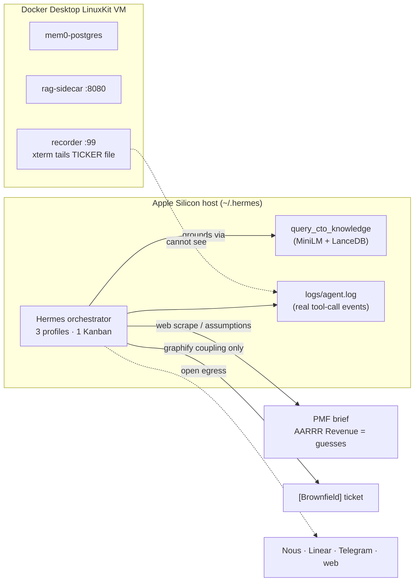
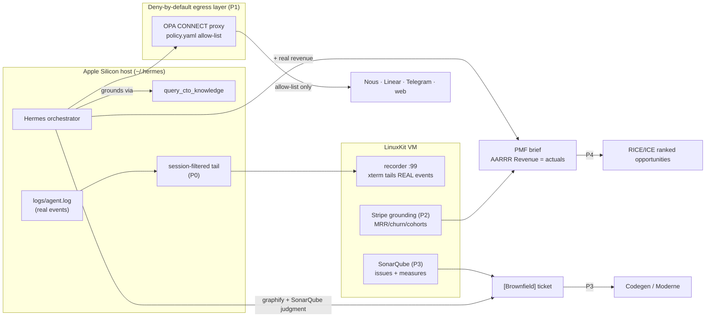

### Summary of change request

The Sovereign CTO Stack is the full-build epic (GLO-13). **Phases 0–5 are already built and verified** — the public-safe repo, the Hermes orchestrator boot, the textbook-grounded RAG brain (`query_cto_knowledge`), the tech-debt auditor hero loop, the PMF research loop, and the self-perpetuating documentation/ticket workflow. The research document confirms all of this against the live repo with no open questions.

The actionable forward work in this epic is **Part B: the prioritized deferred backlog (P0→P4)**, plus the Part C remnants and the Part D closeout (author the next epic, GLO-14). This design discussion is about **how to execute that backlog**. We are taking the **full P0→P4 scope** (resolved Q1), built greedily for the competition video. The specific design decisions inside each item build on existing surfaces:

- **P0** — replace the scripted progress ticker in the recorded demo with *real* `agent.tool_executor` tool-call events (quick win).
- **P1** — deny-by-default egress hardening (NemoClaw/OpenShell) on Apple Silicon — the headline "sovereign"/safety competition requirement.
- **P2** — Stripe integration grounding the PMF brief's AARRR Revenue/Retention in real MRR/churn — competition requirement.
- **P3** — SonarQube (DETECT) + graphify (KEEP) → Hermes (JUDGMENT) → Codegen/Moderne (REMEDIATE).
- **P4** — full PMF loop (multiple RICE/ICE-ranked opportunities, real-usage feedback).

### Current State

- The recorded `.mp4` demo shows a left pane driven by a **scripted ticker** (`printf` a line every 2s mentioning `query_cto_knowledge` as a fixed string). The real `-z` agent output floods in as one buffered burst at the end. Genuine per-tool-call events *do* exist, but in `~/.hermes/logs/agent.log`, which the recorder container can't see — so the demo *describes* tool calls rather than *showing* them firing.
- There is **no deny-by-default egress control.** Outbound calls (Nous inference, Linear MCP, Telegram, web scrape) are unrestricted; compose only publishes ports and binds volumes. The "sovereign" safety posture is asserted in docs but not enforced at runtime.
- The PMF brief's **Revenue/Retention/Referral cells are grounded only in web-scraped competitor pricing** ("$20–$600/user/month" from vendor pages) — never in real billing data. The product-fit story rests on assumptions, not actuals.
- Tech-debt detection comes **only from graphify coupling topology** (the `frontend=7`/`checkout=6` gRPC hub map). There is no code-quality/issue signal (bugs, code smells, complexity, coverage) and no autonomous remediation back-end — the loop stops at a filed `[Brownfield]` ticket.
- The PMF loop files **one** `[Product]` opportunity per run; there is no cross-opportunity ranking or feedback on shipped bets.

### Desired End State

- The submitted demo video is a **comprehensive showcase of the whole project** — not just the tech-debt hero loop. As much as is feasible by the deadline, it shows: real `query_cto_knowledge` / `save_issue` tool calls firing live; the **graphify** service graph; the **PMF loop** (brief + `[Product]` ticket); **Stripe**-grounded AARRR revenue; **NemoClaw/egress** enforcement (e.g. a denied CONNECT being refused); **SonarQube** issues; and the filed Linear ticket(s) appearing in the browser. **Explicit fallback:** if a given component can't be shown in time, the video still ships with the best set of segments currently possible. The existing non-blank/non-static guards still pass per segment.
- The stack runs with **deny-by-default egress**: only Linear / Telegram / Nous-inference / web-scrape endpoints are reachable, enforced out-of-process, with an auditable `policy.yaml` as the artifact — turning the sovereignty claim into an enforced (or demonstrably-enforced-where-the-kernel-allows) property.
- The PMF brief's **AARRR Revenue/Retention sections cite real MRR/churn/cohort data** from Stripe (test-mode) instead of assumptions, materially upgrading product-fit credibility.
- The tech-debt loop fuses **SonarQube quality signals + graphify coupling**, with Hermes as the judgment/curation layer deciding what's worth fixing and routing to a remediation back-end (Codegen / Moderne).
- The PMF loop ranks **multiple opportunities (RICE/ICE)** grounded in real usage + Stripe data with a shipped-bet feedback loop.
- On closeout, **GLO-14 is authored** capturing the Part C remainder + newly discovered items, snapshotted into `tickets/`.

### What we're not doing

- **Not rebuilding Phases 0–5.** They are built and verified; the ticket captures them so the system *could* be rebuilt, but that is documentation, not work for this pass.
- **Not standing up the full mem0 OSS server + Next.js dashboard** (Part C) — the SDK-on-host path is sufficient and the dashboard verifies no phase.
- **Not wiring OpenHands via Portal/LiteLLM** (Part C) — the greenfield path stays "Hermes research → HumanLayer Linear ticket → Claude Code executes."
- **Not building the two-account / cross-host coordination** (Part C) — single-account/multi-profile is what makes the shared Kanban work.
- **Not adding local GPU inference** — no CUDA on Apple Silicon; inference stays cloud (Nous).
- **Not the P2 secondary billing-path tech-debt audit as part of P2** — it folds into the P3 SonarQube slice instead (resolved Q4).
- **Not moving Hermes into a MicroVM** for this pass — host-orchestrator egress confinement (Q3 Option B) is documented as a path for GLO-14, not built now.

### Proposed End State Architecture

Before — the two hero loops share a grounding spine; the recorder paints a scripted surface; egress is open; PMF revenue cells are assumption-grounded:



After — the recorder tails the real event stream; an egress-control layer gates all outbound; Stripe grounds the revenue cells; SonarQube + remediation and the ranked PMF loop are all in scope (full P0→P4, resolved Q1):



**Execution shape.** We are taking the **full P0→P4** scope this pass (resolved Q1), built greedily for the competition video: do P0→P4 **in order**, each as a thin verifiable slice with its own assert gate (mirroring the existing `assert_*.py` pattern). Progress is tracked as a **checklist on GLO-13 itself** (resolved Q5) — no per-item sub-issues — and each slice's artifacts are snapshotted to `tickets/` where applicable. The demo recording is rebuilt as a comprehensive multi-segment showcase as each slice lands (resolved Q2 + Q6), degrading gracefully to the best-possible video if any segment isn't ready. On closeout — once the slice is substantially actioned — author GLO-14.

### Design Questions

*(all design questions resolved — see below)*

### Resolved Design Questions

#### Q3-sub — P1 egress verification gate: negative test + positive-path (Option β)

**Decision:** the gate's **load-bearing assertion is the negative test** — attempt a CONNECT to a **non-allow-listed** host through the OPA proxy and assert it is **refused** — plus a positive-path check that an allow-listed host (e.g. `api.linear.app:443`) succeeds.

**Rationale (yours): "Let's go with your recommendation."** Deny-by-default is only meaningful if you can demonstrate a denial; a positive-only gate (Option α) is satisfiable by a proxy that blocks nothing. The **network OPA CONNECT-proxy layer is independent of the Landlock filesystem layer**, so the negative network test stays reliable *even where* Landlock `best_effort` silently degrades (the macOS bug) — a trustworthy safety assertion without the fragile kernel dependency. It also gives the Q6 video a concrete dramatic beat (a blocked connection visibly refused).

**Not chosen:** Option α (positive-path only) — easy but proves nothing about denial.

#### Q6 — Comprehensive showcase video: hybrid montage (Option C), simple ffmpeg concat

**Decision:** build the demo as a **hybrid montage**. Live split-screen capture for the inherently-visual hero loops (tech-debt graphify + ticket appearing in browser; PMF brief). For the non-visual proofs, add short purpose-built segments: a terminal showing the **denied egress CONNECT being refused** (the Q3-sub β test), the **Stripe-grounded AARRR** section of the brief on screen, the **SonarQube** issues list, and the ranked **PMF** opportunities. Each segment runs `verify_recording.py` independently so one bad segment is dropped and the rest still ship — the automatic "best-video-currently-possible" fallback.

**Sub-decision (you asked for my recommendation + explanation): keep concatenation simple — `ffmpeg concat` of per-segment `.mp4`s with generated title-card frames, no editing suite.** Why:

1. **Reproducibility** — the whole point of this repo is that everything regenerates from a clean clone with no manual steps. A GUI editor (iMovie/Premiere) would make the final video a hand-made artifact that can't be rebuilt by a gate or a fresh clone, breaking the project's core invariant.
2. **Graceful fallback for free** — a scripted concat reads whatever segments passed `verify_recording.py` and stitches exactly those. If Stripe or SonarQube isn't ready, its segment simply isn't in the list and the script still produces a valid video, zero manual intervention — exactly the fallback you asked for.
3. **It's already the house style** — title cards are just more self-contained HTML painted onto `:99` (the `render_service_graph.py` pattern), and `ffmpeg` is already the recorder's only video dependency, so no new tools enter the stack.

A manual editor would be prettier but costs reproducibility, automation, and determinism — the exact things this stack optimizes for.

**Not chosen:** Option A (single continuous take) — most authentic but one failure kills the whole take and the non-visual proofs don't render; Option B (pure segmented montage) — fine, but Option C's hybrid is strictly better because it keeps the live split-screen authenticity for the loops that *are* visual.

#### Q1 — Execution scope: Full P0→P4 (Option C)

**Decision:** take the **full P0→P4** scope this pass and "see what we can get done so we can get as much as we can into the competition video submission." Build in order, greedily, each as a thin verifiable slice.

**Rationale (yours):** maximize what lands in the submission. We accept the higher deadline risk (P1's two macOS bugs, P3/P4's scope) and lean on per-slice gates + the Q6 graceful-fallback video so partial completion still ships a strong artifact.

**Not chosen:** Option A (competition slice P0+P1+P2, defer P3/P4) — safer but leaves SonarQube/full-PMF out of the submission; Option B (P0-only then reassess) — lowest risk but under-delivers on the vision.

#### Q2 — P0 demo authenticity: host-side filtered tee + ticket-in-browser ending, tail-from-now (Option A + C ending)

**Decision:** a host process tails `~/.hermes/logs/agent.log`, filters real `agent.tool_executor` / `agent.conversation_loop` lines, and appends them into the existing `recordings/agent_<job>_<ts>.log` the recorder's xterm already tails (**no compose change**); after the run, navigate the right-pane Chromium to the filed Linear ticket to close the loop visually. Session scoping is **tail-from-now** (`tail -n0 -F`), acceptable because the demo is a single run.

```bash
# started just before the hermes -z run, killed after
tail -n0 -F ~/.hermes/logs/agent.log \
  | grep --line-buffered -E 'agent\.tool_executor|agent\.conversation_loop' \
  | sed -u 's/.*tool \(.*\) completed.*/[live] tool \1 completed/' \
  >> "$AGENT_LOG"
```

**Rationale:** smallest surface change, keeps every existing non-blank/non-static guard, and visibly closes file→ticket. **Not chosen:** Option B (bind-mount `~/.hermes/logs/` into the recorder) — more authentic but edits compose and needs in-container session filtering; capturing the exact session_id — unnecessary for a single-run demo.

#### Q3 (main) — P1 egress enforcement target: enforce `policy.yaml` on containerized targets (Option C, scoped to Option A targets)

**Decision:** ship the reviewable `policy.yaml` allow-list (Linear / Telegram / Nous-inference / web-scrape) with `enforcement: enforce`, applied to the **containerized** sub-tools inside the LinuxKit VM, on Docker Desktop ≥ 4.60.0; document the Landlock `best_effort` degradation honestly. The path to confining the host orchestrator's own egress via a MicroVM (Option B) is recorded for GLO-14, not built now.

```yaml
version: 1
network_policies:
  linear_api:    { endpoints: [{ host: api.linear.app,                 port: 443, enforcement: enforce, access: read-write }] }
  telegram_api:  { endpoints: [{ host: api.telegram.org,               port: 443, enforcement: enforce, access: read-write }] }
  nous_inference:{ endpoints: [{ host: inference-api.nousresearch.com, port: 443, enforcement: enforce }] }
  # + web-scrape endpoints; node agents must also whitelist /usr/local/bin/node
```

**Rationale (yours): "yes, this is great."** Produces the headline safety artifact and an enforced layer without betting the deadline on the two macOS bugs. **Not chosen:** Option A alone (no enforced policy artifact — under-delivers the safety story); Option B now (strongest, but biggest moving-parts/DNS risk on the deadline). *(The verification-strength sub-decision is open as Q3-sub above.)*

#### Q4 — P2 Stripe: stdlib reference client + test-mode data; secondary billing audit folded into P3 (Option B)

**Decision:** `scripts/stripe_client.py` (stdlib + Stripe REST + `STRIPE_API_KEY`) writes `recordings/stripe_metrics.json`; the PMF brief grounds the AARRR Revenue/Retention cells against it and cites it. Use Stripe **test-mode** (or seeded sample) data. The **secondary billing-path tech-debt audit is not part of P2** — since we're doing full P0→P4, it folds into the **P3 SonarQube** slice (where billing code becomes a priority surface).

**Rationale (yours): "Agreed."** Reference-client pattern is lower-risk than depending on a third-party Stripe MCP; test mode keeps it credible and the repo clean-cloneable. **Not chosen:** Option A (Stripe MCP) — most consistent with the MCP grounding pattern but adds OAuth/token plumbing risk; real-account data — unnecessary and unsafe for a hackathon.

#### Q5 — Closeout mechanics: checklist on GLO-13, author GLO-14 at the end (Option B)

**Decision:** track the P0→P4 items as a **checklist on GLO-13 itself** (no per-item GLO sub-issues), and author **GLO-14** at the end once the work is substantially actioned. This consciously simplifies away from the ticket's "each item is its own sub-issue" acceptance criterion.

**Rationale (yours): "let's just do this. simpler."** Per document-precedence (design discussion > ticket), this decision supersedes the original acceptance criterion. **Not chosen:** Option A (a GLO sub-issue per item) — matches the literal criterion but is heavier process overhead for a single-builder deadline push. *(GLO-14 is still authored on closeout via the existing idempotent `file_fullbuild_ticket.py` → `snapshot_tickets.py` path.)*

### Patterns to follow

These are existing patterns in the repo that the backlog work should follow.

#### Behavioral assert gate per slice — `scripts/assert_*.py` (exit-0-on-pass)

Every phase ships an external, checkable assertion (topology, brownfield ticket, PMF run, recording, full-build structure). Each new backlog slice should add its own gate in the same shape.

```python
# scripts/assert_brownfield_ticket.py — checkable property of the artifact, not a hope
REQUIRED_SOURCES = {"managing-technical-debt.md", "software-architecture.md"}
# asserts: [Brownfield] prefix · brownfield label · a src/<service>/ path ·
#          Grounded in: *.md citation · ≥4 distinct sources (multi-angle grounding)
```

```python
# P0: scripts/verify_recording.py already proves non-blank + non-static.
# Extend with an assert that the demo log contains ≥1 REAL agent.tool_executor line
# (e.g. "tool mcp_cto_knowledge_query_cto_knowledge completed") for the run's session.
```

#### Stdlib-only reference MCP/HTTP client — `scripts/linear_mcp.py`

The reusable client pattern (token resolution → `initialize`/`initialized` handshake → session-id persistence → SSE unwrap → `L.tool()`). A Stripe client (Q4 Option B) or a SonarQube REST client (P3) should follow it.

```python
# scripts/linear_mcp.py — token resolution chain, no third-party deps
# $LINEAR_MCP_TOKEN → ~/.hermes/profiles/<profile>/mcp-tokens/linear.json → ~/.hermes/mcp-tokens/linear.json
L.init(); L.tool("save_issue", {...})
```

#### MCP server registration contract — `hermes/config.yaml` `mcp_servers`

The per-server schema any new tool (Stripe MCP, SonarQube) registers under.

```yaml
mcp_servers:
  <name>:
    url: "<streamable-http endpoint>"   # required
    tools: { include: [<tool>, …] }     # optional allowlist
    timeout: <seconds>                  # optional
    auth: oauth                         # token at ~/.hermes/[profiles/*/]mcp-tokens/<name>.json
```

#### Multi-angle grounding + cite-the-union — `SOUL.md` / `AGENTS.md` / skills

Every CTO deliverable issues one `query_cto_knowledge` call per dimension and cites the union of `source_file`s; skills document the field shape in prose and reuse each other's call shapes. New grounded behaviors (Stripe-grounded AARRR, SonarQube-grounded debt) must keep emitting `Grounded in: <source_file>` lines so the assert gates still pass.

#### Idempotent file-+-snapshot for tickets — `file_fullbuild_ticket.py` → `snapshot_tickets.py`

Filing/updating a ticket is idempotent (id arg → env → `find_existing()`), and immediately snapshots `tickets/<ID>.md` so git stays the authoritative record. The GLO-13 checklist update and the closeout GLO-14 authoring (resolved Q5) reuse this exact path.

#### Self-contained single-file HTML surface — `render_service_graph.py`

A module-level f-string template + inlined `json.dumps` + one CDN `<script>`, no build step. Any new painted demo surface (P0 ticket view, future dashboards) should follow this zero-dependency pattern so the recorder can open it by path.
