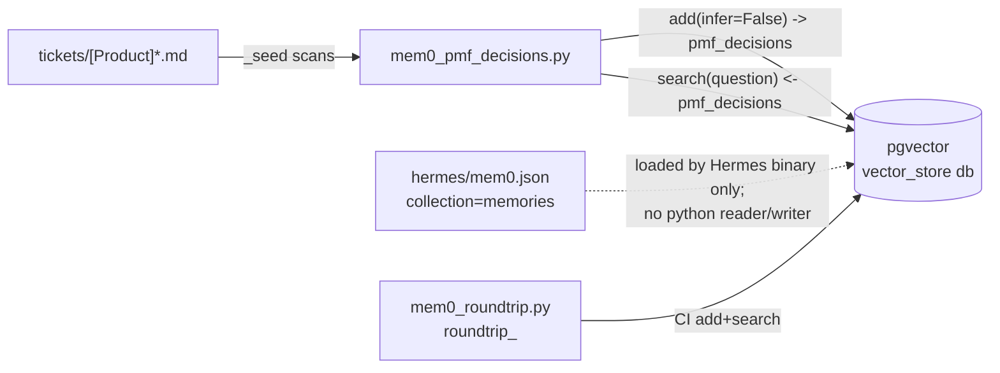
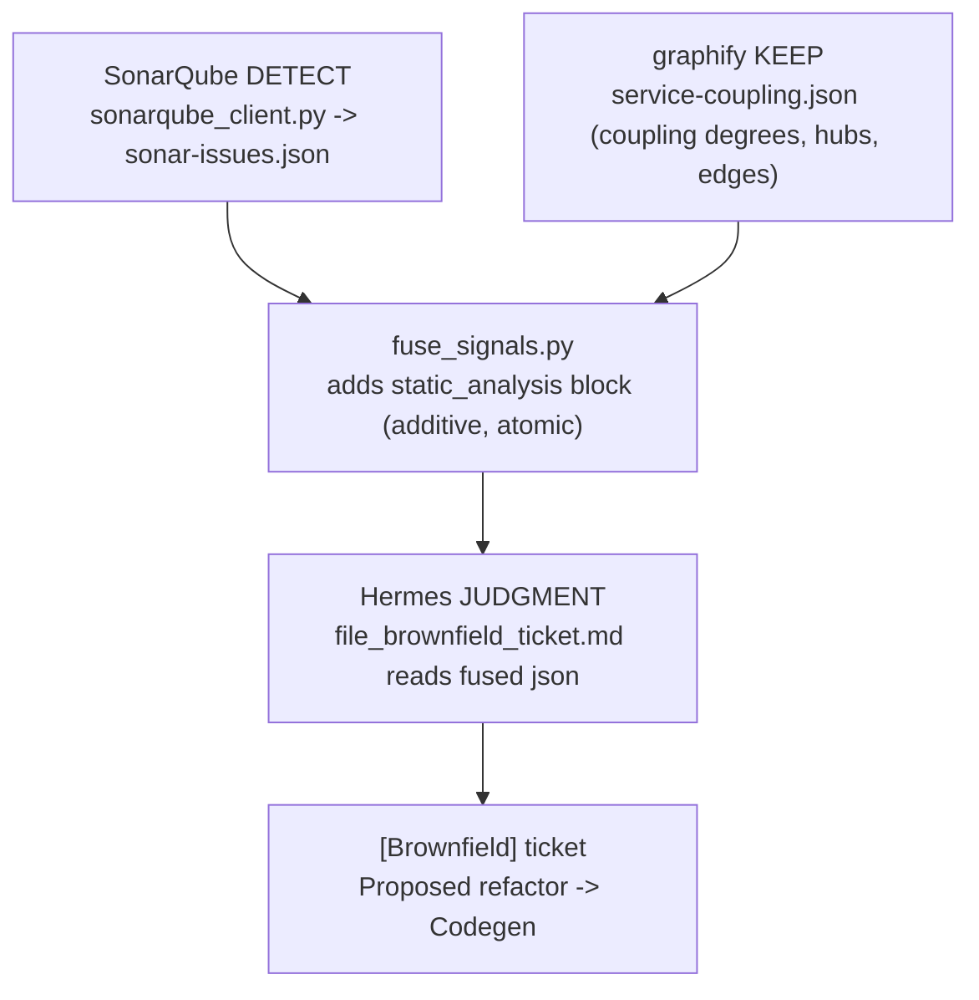

# Research: GLO-14 Sovereign CTO Stack — Current State of the GLO-13 P0–P4 Build

**Date**: 2026-06-28 (PT)
**Git Commit**: `ac7b9052272583aa330fe82e237f346b4df64ee4`
**Branch**: `glo-13-full-build-sovereign-cto-stack-complete-vision-all-phases`
**Repository**: GS_AISafetyHackathon

> **All file citations are relative to the worktree root**
> `/Users/laptop/.humanlayer/workspaces/glo-13-full-build-sovereign-cto-stack-complete-vision-all-phases/sovereignCTO`
> unless otherwise noted. This is where the GLO-13 P0–P4 work lives; `main`'s `sovereignCTO/` is an
> earlier snapshot (see §1).

## Research Question

1. Trace the full mem0 data flow end to end across `scripts/mem0_pmf_decisions.py`, `scripts/mem0_roundtrip.py`, `hermes/mem0.json`, `scripts/assert_pmf_ranked.py`: SDK config against the docker-compose pgvector backend, which collections exist (`memories` vs `pmf_decisions`), where reads happen, where writes happen, and whether read and write paths touch the same collection.
2. Across the agent loops, where does each loop persist its decision/output today, and at what point in each loop would a "record this decision" step sit relative to the `query_cto_knowledge` consult and the ticket-filing step?
3. How does the Hermes orchestrator's webhook receiver work — what `hermes webhook` exposes, how a run is "resumed," and how external MCP back-ends are registered, authorized, and invoked; document the `~/.hermes/` OAuth/token layout.
4. What do the Greptile code-review product and its GitHub App / API offer for programmatically triggering a PR review and ingesting findings, and what `pull_request` (opened/synchronize) webhook fields would a receiver parse? (web/library research)
5. How does the demo recording pipeline produce its "ticket in browser" ending — trace `record_run.sh`, `recorder/`, `render_ticket_card.py`, `verify_recording.py`; where a persistent Chromium profile would attach.
6. How is the NemoClaw/OpenShell egress sandbox built and enforced — `egress/policy.yaml`, `egress/Dockerfile`, `assert_egress_policy.py`; which compute driver, how OPA CONNECT + Landlock are invoked, the allow-list, and — critically — whether the host Hermes orchestrator runs inside or outside the sandbox.
7. What does OpenShell document about its MicroVM compute driver (libkrun + Apple Hypervisor.framework) vs. the container driver, and the known macOS limitations? (web/library research + tradeoffs doc)
8. How does the PMF ranking + ledger work — `recordings/pmf_ledger.json`, `assert_pmf_ranked.py`, the PMF skill: ledger fields (incl. `shipped`), RICE/ICE computation, real signals, and where a `shipped:false→true` flip would read from.
9. How is the remediation-routing decision encoded — `hermes/config.yaml`, `file_brownfield_ticket.md`, the SonarQube/graphify fusion, the GLO-16 ticket — how Codegen is named and how a Moderne/OpenRewrite MCP would be registered.
10. State of the rolled-forward "Part C" items — mem0 OSS server/dashboard scaffolding, any Next.js/frontend code, OpenHands, and Portal/LiteLLM (`provider: nous`, `127.0.0.1:8645/v1`); if any frontend exists, its component library/design tokens/theming.

## Research Methodology (verbatim)

This document will remain objective and factual. It does not contain any recommendations or implementation suggestions.
Open questions will not ask Why things haven't been built or what should be built in the future.

There is no "implementation" section - that is intentional.

## Summary

The Sovereign CTO Stack is a self-hosted, locally-grounded "AI CTO" assembled from an **external Hermes orchestrator binary** (`hermes-agent`, not source in this repo) driving two profile-scoped agent loops — a **tech-debt/architecture audit loop** (`cto-architecture`) and a **PMF research loop** (`cto-market`) — plus a battery of Python `assert_*.py` gates that make each phase falsifiable. Every loop follows the same spine: it **grounds** itself by calling `query_cto_knowledge` against a local RAG sidecar, produces a decision artifact, **files a Linear ticket** via a Streamable-HTTP MCP client, and then **snapshots** that ticket to a git-tracked `tickets/GLO-NN.md` file. Decisions persist as those ticket snapshots, as `recordings/*` artifacts (briefs, ledgers, MP4s, logs), as rows in a shared `~/.hermes/kanban.db`, and as git commits — but they are **never written back into mem0**.

That last point is the spine of the mem0 finding. mem0 runs as the self-hosted OSS SDK against a pgvector Postgres container, and there are **two unrelated collections**: `memories` (declared in `hermes/mem0.json`, owned exclusively by the Hermes runtime) and `pmf_decisions` (declared and used only by `scripts/mem0_pmf_decisions.py`). The PMF consult script's read path and write path use the **same** `pmf_decisions` collection — it seeds prior `[Product]` tickets in and searches them back out — but the seed source is the `tickets/` directory, not a closing-the-loop write from the agent. The `memories` collection has no Python writer or reader at all. Correspondingly, the PMF ledger carries a `shipped` boolean that always starts `false`; **no code flips it to `true`** and the only reader (`assert_pmf_ranked.py`) merely checks the field exists. The "record this decision to mem0" step, in both loops, would sit in the gap **between the `save_issue` ticket-filing call returning an ID and the `snapshot_after_run.sh` snapshot step**.

The remediation-routing decision is a three-layer pipeline — SonarQube **DETECT** → graphify **KEEP** (coupling) → Hermes **JUDGMENT** — fused additively by `scripts/fuse_signals.py` into `graphify-out/service-coupling.json`, where a `priority_score` boosts billing-path services and an `exemplar_issue` is severity-ranked. The skill text routes the chosen finding to **Codegen** (registered under `mcp_servers` with `auth: oauth`, but "named-only" — no live agent run is auto-triggered); Moderne/OpenRewrite is documented as the recipe-amenable alternative deferred to GLO-14 P6. The recording pipeline captures a split-screen Xvfb display with ffmpeg x11grab inside a throwaway Docker container and ends on a `file://` HTML render of the latest ticket snapshot (via marked.js) — the container's Chromium runs with **no `--user-data-dir`**, so it is an unauthenticated throwaway profile (the live-Linear-URL path is disabled precisely because of the auth wall). The egress sandbox (`openshell sandbox create --no-keep --policy egress/policy.yaml`) enforces deny-by-default egress on **containerized sub-tools** via an OPA CONNECT proxy at `127.0.0.1:17670` plus best-effort Landlock; the **host Hermes orchestrator itself runs outside any sandbox** today.

On the rolled-forward "Part C" items: **no frontend code of any kind exists in the repo** — no `package.json`, no Next.js, no React/Vue/Svelte, no design tokens. The mem0 OSS server + Next.js dashboard, OpenHands, and LiteLLM are all prose-only deferrals. What *is* wired is the Nous Portal inference path (`provider: nous`, local OpenAI-compatible proxy at `127.0.0.1:8645/v1`, `NOUS_PORTAL_API_KEY`). Greptile and the OpenShell MicroVM driver are external products documented via web research (§9, §10) and are not yet integrated in code — they are GLO-14 backlog.

## Detailed Findings

### 1. The P0–P4 build lives only on the worktree branch; `main` is an earlier snapshot

The research target is the git worktree at `/Users/laptop/.humanlayer/workspaces/glo-13-full-build-sovereign-cto-stack-complete-vision-all-phases/sovereignCTO`, checked out on branch `glo-13-full-build-sovereign-cto-stack-complete-vision-all-phases` at commit `ac7b9052`. The most recent commits show the P0–P4 work and the GLO-14 authoring:

```text
ac7b905  Address Greptile PR #1 review: egress positive-test fix, stripe seed pagination, pin SonarQube image
2e07bfb  GLO-14: clarify P4 uses OpenShell's MicroVM driver (still NemoClaw, deeper)
377b433  GLO-14: reorder backlog — Greptile loop to P2, Moderne to P6
660fab5  GLO-14: add P6 — autonomous PR-review loop (HumanLayer PR -> Hermes -> Greptile -> triage)
f275992  GLO-13 Phase 6 (Closeout): showcase montage + author GLO-14 + checklist + living docs
```

The worktree was confirmed to contain the P0–P4 assert scripts (`assert_demo_authenticity.py`, `assert_egress_policy.py`, `assert_stripe_grounding.py`, `assert_sonar_fusion.py`, `assert_pmf_ranked.py`, `assert_showcase_video.py`) and the `egress/` directory — all present and populated. The `main` checkout at `/Users/laptop/Developer/GS_AISafetyHackathon/sovereignCTO` is the earlier snapshot described in the research-questions doc and is missing these. No file-level divergence was observed within the worktree itself by the analyzers; the live artifacts (`graphify-out/service-coupling.json` with its fused `static_analysis` block, `recordings/pmf_ledger.json`, the `tickets/GLO-*.md` snapshots) are all present.

### 2. mem0 runs OSS-mode against pgvector, with two unrelated collections and an asymmetric write path

mem0 is configured as the **self-hosted OSS SDK** pointed at a pgvector Postgres container. The container is defined in `docker-compose.yml:15-35` as `pgvector/pgvector:pg16`, published on host port `${MEM0_PG_HOST_PORT:-5433}` (deliberately 5433 to dodge a host-native Postgres on 5432), with credentials `mem0/mem0` and DB `vector_store`. On first init it runs `scripts/init-pgvector.sql`, whose entire body is `CREATE EXTENSION IF NOT EXISTS vector;` (`scripts/init-pgvector.sql:4`).

There are **three** mem0 config objects in the repo, declaring **three** collections:

| Config object | File | `collection_name` | `user_id` | Role |
|---|---|---|---|---|
| Hermes runtime config | `hermes/mem0.json:7-34` | `memories` | `sovereign-cto` | Loaded by the Hermes binary; **no Python reader/writer** |
| PMF prior-decisions consult | `scripts/mem0_pmf_decisions.py:58-94` | `pmf_decisions` (env `MEM0_PMF_COLLECTION`) | `sovereign-cto-pmf` | The only script that reads AND writes a durable collection |
| CI smoke test | `scripts/mem0_roundtrip.py:67-69` | `roundtrip_<uuid8>` (ephemeral) | — | Fresh collection per run; never depends on prior state |

All three resolve the same connection defaults (`MEM0_PG_HOST`=127.0.0.1, `MEM0_PG_PORT`=5433, user/pass `mem0`, db `vector_store`, `embedding_model_dims`=384) and use a HuggingFace `all-MiniLM-L6-v2` embedder with an Ollama LLM (`qwen2.5-coder:14b`).

The OSS config shape (from `hermes/mem0.json:7-34`):

```json
{ "mode": "oss", "user_id": "sovereign-cto", "agent_id": "orchestrator",
  "oss_config": {
    "vector_store": { "provider": "pgvector", "config": {
        "host": "127.0.0.1", "port": 5433, "user": "mem0", "password": "mem0",
        "dbname": "vector_store", "collection_name": "memories", "embedding_model_dims": 384 } },
    "embedder": { "provider": "huggingface", "config": { "model": "sentence-transformers/all-MiniLM-L6-v2" } },
    "llm": { "provider": "ollama", "config": { "model": "qwen2.5-coder:14b", "ollama_base_url": "http://localhost:11434" } } } }
```

**Where writes happen.** The only durable `mem.add()` is in `scripts/mem0_pmf_decisions.py:156`, writing into `pmf_decisions` with `infer=False` and `metadata={"decision_id":…, "kind":"product_decision"}`. It is idempotent: `_seed()` first `mem.search(decision_id, filters={"user_id": USER_ID})` at line 149 and skips if already present. The facts it seeds come from scanning `tickets/[Product]*.md` — i.e. the seed source is the ticket snapshots, not a fresh agent decision. (`mem0_roundtrip.py:83` also calls `add()`, but only into its throwaway `roundtrip_*` collection.)

**Where reads happen.** `scripts/mem0_pmf_decisions.py:186` calls `mem.search(question, filters={"user_id": USER_ID})` against `pmf_decisions` — the same collection `_seed()` writes to.



The load-bearing finding: the **read and write paths in the PMF script use the same `pmf_decisions` collection**, but `memories` (the collection the Hermes runtime config declares) has **no Python code that reads or writes it**. The two code paths share only the physical Postgres container.

#### Testing patterns
- `scripts/mem0_roundtrip.py` is itself the Phase-1 CI gate: it `add()`s then `search()`es in an ephemeral collection and exits 0 on success.
- `scripts/assert_pmf_ranked.py:134-143` verifies the ledger's `prior_decisions_consulted.mem0_hits` is populated (the downstream evidence that the `pmf_decisions` read path ran).

### 3. Two agent loops share one spine: ground → produce → file ticket → snapshot

There are two live, profile-scoped agent loops plus one standalone filing utility:

| Loop | Driver | Hermes profile | Skill | Kanban? |
|---|---|---|---|---|
| Tech-debt / architecture audit ("hero") | `scripts/record_run.sh:296-305` (JOB=hero) | `cto-architecture` | `file_brownfield_ticket` | no |
| PMF research | `scripts/pmf_kanban_run.sh` or `record_run.sh:307-315` (JOB=pmf) | `cto-market` | `pmf_brief` (+ `pmf_rank`) | yes (`~/.hermes/kanban.db`) |
| Full-build epic filing | `scripts/file_fullbuild_ticket.py` (direct Python) | — | — | no |

Both agent loops enforce the same ordering, set as a non-negotiable rule in `hermes/AGENTS.md:10-13` and `hermes/SOUL.md:31-37`: **call `query_cto_knowledge` (multi-angle) before any CTO function**, then file the ticket, then snapshot. The PMF loop adds a second, distinct consult step (mem0 + git prior decisions) after the `query_cto_knowledge` grounding and before ranking.

Tech-debt loop, as pseudocode (`record_run.sh` + `file_brownfield_ticket.md`):

```text
record_run.sh JOB=hero
  read graphify-out/service-coupling.json (+ fused static_analysis) and sonar-issues.json
  [CONSULT query_cto_knowledge] x4 angles      file_brownfield_ticket.md:46-67
      coupling / tech-debt / decomposition / delivery-throughput  (union of source_files)
  [FILE TICKET] mcp_linear save_issue           file_brownfield_ticket.md:69
      title "[Brownfield] …", label Brownfield, priority 2,
      body cites SonarQube issue key + src/<svc>/ file + "Proposed refactor — route to Codegen"
  emit_real_tool_calls() drains state.db -> recordings/agent_hero_*.log   record_run.sh:230-249
  render ticket card, stop ffmpeg, verify
  [SNAPSHOT/PERSIST] snapshot_after_run.sh -> tickets/GLO-NN.md           record_run.sh:401-404
```

PMF loop persistence is richer because of the Kanban lifecycle (`pmf_kanban_run.sh`): `kanban create` → `claim` (lines 50-62), agent runs (line 297-300) producing `recordings/stripe_metrics.json`, `recordings/pmf_prior_decisions_*.json`, `recordings/pmf_ledger.json`, `recordings/pmf_brief_run_*.md`, then `kanban complete` writes a `task_runs` row with summary+metadata (lines 359-362), then `snapshot_after_run.sh` (lines 368-372), then `recordings/.last_pmf_task_id` (line 381).

**Where decisions persist today**, by loop:

| Artifact | Path | Written by |
|---|---|---|
| Linear ticket (live) | Linear API | `save_issue` MCP tool |
| Ticket git snapshot | `tickets/GLO-NN.md` | `scripts/snapshot_tickets.py:115` |
| Agent tool-call log | `recordings/agent_*.log` | `record_run.sh:230-249` |
| PMF brief | `recordings/pmf_brief_run_*.md` | agent / stub |
| RICE ledger | `recordings/pmf_ledger.json` | inline Python in `pmf_kanban_run.sh:154-224` |
| Prior-decisions JSON | `recordings/pmf_prior_decisions_*.json` | `mem0_pmf_decisions.py` |
| Kanban lifecycle | `~/.hermes/kanban.db` (tasks/task_events/task_runs) | `hermes kanban …` |
| MP4 / showcase | `recordings/*.mp4` | ffmpeg via recorder |

The position a hypothetical "record this decision to mem0" step would occupy is **identical in both loops**: after the `save_issue` call returns an identifier and before `snapshot_after_run.sh` runs (`record_run.sh:401`; `pmf_kanban_run.sh:368`). The GLO-14 epic body (`scripts/file_fullbuild_ticket.py:314-327`; `tickets/GLO-14.md:151`) explicitly names this gap — loops read prior decisions but never write new ones back, which is why `memories` is empty.

#### Testing patterns
- Tech-debt loop: `assert_brownfield_ticket.py` (label + multi-angle grounding, ≥4 distinct sources, both `managing-technical-debt.md` and `software-architecture.md` cited), `assert_sonar_fusion.py` (fused artifact + back-end naming), `assert_demo_authenticity.py` (real `[live] tool … completed` lines in the log).
- PMF loop: `assert_pmf_run.py` (brief grounded + Kanban created→claimed→completed lifecycle), `assert_pmf_ranked.py` (ledger ≥2 ranked opps + prior-decisions consult), `assert_product_ticket.py` (capability-gap + market URL + grounding), `assert_stripe_grounding.py`.

### 4. The PMF ledger ranks by RICE and carries a `shipped` flag that nothing flips

`recordings/pmf_ledger.json` is produced by inline Python in `scripts/pmf_kanban_run.sh:154-224`. Its fields:

| Field | Notes |
|---|---|
| `generated_at`, `question`, `scoring_model` (`"RICE"`), `north_star` (`"opportunities_shipped"`) | header |
| `prior_decisions_consulted.{mem0_hits[],git[],already_decided_ids[]}` | from the mem0+git consult |
| `opportunities[].{rank,title,rice_score}` | rank 1 = highest |
| `opportunities[].inputs.{reach,impact,confidence,effort}` | the RICE inputs |
| `opportunities[].grounded_in[]` | corpus `*.md` + `stripe_metrics.json` |
| `opportunities[].graphify_feasibility` | authored inline (coupling-hub note) |
| `opportunities[].prior_decision` | null or prior `[Product]` reference |
| `opportunities[].shipped` | **always written `false`** (`pmf_kanban_run.sh:222`) |

RICE is computed at `pmf_kanban_run.sh:190-191`: `round((reach * impact * confidence) / effort, 1)`, then sorted descending at line 195. The live ledger's three opportunities score 67.5, 32.4, 10.0 — all with `"shipped": false`.

Real signals feeding the ranking:
- **Stripe MRR/churn/cohorts** — `scripts/stripe_client.py:184-240` fetches `api.stripe.com/v1/subscriptions?status=all`, computes MRR (interval-normalized), lifetime churn `canceled/(active+canceled)`, and per-cohort retention, writing `recordings/stripe_metrics.json` atomically. `pmf_kanban_run.sh:154-158` reads it and drives the `Grounded in: stripe_metrics.json (real MRR $…, churn …%)` annotation. The numeric RICE inputs themselves are authored inline; Stripe data grounds the narrative.
- **mem0 + git prior decisions** — read at `pmf_kanban_run.sh:114-147` to populate `prior_decisions_consulted` and `already_decided_ids`.
- **`query_cto_knowledge`** — in the live path the agent issues one query per PMF dimension; results determine which corpus files appear in `grounded_in[]`.
- **`graphify-out/service-coupling.json`** — referenced in `hermes/skills/pmf_rank.md:79-80` for the Effort input, but the feasibility text is authored inline; no code reads the JSON during ranking.

The `shipped:false→true` flip: **no code performs it.** Every run writes `false` (`pmf_kanban_run.sh:222`). The only reader is `assert_pmf_ranked.py:124-129`, which asserts the field *exists*, not its value. The skill (`pmf_rank.md:124`) describes the intent ("a later run or a human flips it to `true`"), and `file_fullbuild_ticket.py:370-372` / `tickets/GLO-14.md:151` document it as not-yet-wired.

#### Testing patterns
`assert_pmf_ranked.py` is the primary gate (≥2 numeric scores descending, RICE/ICE model, `grounded_in` union, `shipped` field present, `prior_decisions_consulted` with mem0 hits and/or git). `assert_stripe_grounding.py` verifies the brief echoes the concrete MRR integer and churn % and the literal `Grounded in: stripe_metrics.json` line.

### 5. `hermes` is an external binary; `hermes webhook` is a documented (not-yet-wired) capability, and MCP back-ends register via OAuth into `~/.hermes/`

There is **no Hermes/webhook server source in this repo.** `hermes` is the external `hermes-agent` package installed via `uv tool install hermes-agent` (`docs/setup-guide.md:39`). The string `hermes webhook` appears only in `tickets/GLO-14.md:107` and the generator `scripts/file_fullbuild_ticket.py:330`, describing the GLO-14 P2 plan: a GitHub `pull_request` (opened/synchronize) webhook fires into Hermes' existing `hermes webhook` receiver so the orchestrator **resumes**, kicks off a Greptile review, and triages findings. "Resume" here means the orchestrator is woken by the event and continues a filed ticket's lifecycle — it is a described future behavior, not present code. Completed phases launch each run fresh as one-shot `hermes -p <profile> -z "…"` invocations or via cron; there is no resume-from-checkpoint in the scripts.

MCP back-ends are registered in `hermes/config.yaml:76-89` (a version-controlled reference copied to `~/.hermes/config.yaml` at setup):

```yaml
mcp_servers:
  cto_knowledge:
    url: "http://localhost:8080/mcp"
    tools: { include: [query_cto_knowledge] }
    timeout: 60
  linear:
    url: "https://mcp.linear.app/mcp"
    auth: oauth
  codegen:
    url: "https://mcp.codegen.com/mcp"
    auth: oauth            # token at ~/.hermes/mcp-tokens/codegen.json; CODEGEN_API_KEY in ~/.hermes/.env
    timeout: 120
```

Schema fields: `url` (Streamable-HTTP MCP endpoint), `auth: oauth` (triggers Hermes' MCP OAuth 2.1 device flow), `tools.include` (tool allow-list), `timeout`. Registration is via `hermes mcp add … --url …` then `hermes mcp configure …` (local sidecar, no auth) or `hermes mcp install linear` (browser OAuth, token to `~/.hermes/mcp-tokens/linear.json`). Tools are invoked by name inside the loop — `query_cto_knowledge` surfaces as `mcp_cto_knowledge_query_cto_knowledge`; Linear's `save_issue`/`list_issues`/`get_issue` are called directly. Non-interactive cron/`-z` runs need a cached token, so there is an explicit per-profile token copy step (`docs/setup-guide.md:301-309`).

The `~/.hermes/` layout (from `config.yaml`, `hermes/.env.example`, `docs/setup-guide.md`, `scripts/linear_mcp.py:29-32`):

```text
~/.hermes/
├── config.yaml                 # live config (copied from hermes/config.yaml)
├── .env                        # TELEGRAM_BOT_TOKEN, MEM0_API_KEY, NOUS_PORTAL_API_KEY, CODEGEN_API_KEY
├── auth.json                   # Nous Portal OAuth refresh token (hermes portal login)
├── SOUL.md / AGENTS.md         # always-loaded identity / cwd operating contract
├── kanban.db                   # shared single-host SQLite Kanban
├── sonar-token                 # SonarQube bearer (fallback)
├── mcp-tokens/{linear.json,codegen.json}
└── profiles/{cto-architecture,cto-market}/
        ├── SOUL.md  state.db  cron/jobs.json
        ├── mcp-tokens/linear.json   # copied per-profile
        └── skills/<skill>/SKILL.md
```

`scripts/linear_mcp.py` is the in-repo reference MCP client: it POSTs JSON-RPC to the Streamable-HTTP endpoint, with token lookup order `$SONAR_TOKEN`-style precedence for its own auth, and `init`/`tool` helpers.

#### Testing patterns
No test exercises `hermes webhook` (it is unbuilt). The MCP path is exercised indirectly through the ticket-filing gates (`assert_brownfield_ticket.py`, `assert_product_ticket.py`) which read tickets back via the Linear MCP.

### 6. Remediation routing is a DETECT→KEEP→JUDGMENT fusion that names Codegen as the back-end

The routing decision is a strict four-layer pipeline:



`scripts/sonarqube_client.py:133-235` pulls `/api/issues/search` (paginated) and `/api/measures/component`, mapping components of the form `online-boutique:src/<svc>/…` to a service (`_service_of`, lines 172-179), and writes `graphify-out/sonar-issues.json`. `scripts/fuse_signals.py` reads both files and writes an **additive** `static_analysis` key into `service-coupling.json`, preserving graphify's own keys (lines 147-152, atomic `os.replace`). Inside it:
- `billing_services = {cartservice, checkoutservice, paymentservice, currencyservice}` (line 49)
- `priority_score = (5 if billing else 0) + coupling_degree + sonar_issues` (line 83)
- `exemplar_issue` = highest-severity issue from the pool `billing_hub > billing > hub > src > all`, ranked `{BLOCKER:5…INFO:1}` (lines 93-115); the live exemplar is `go:S1135` INFO at `src/checkoutservice/main.go:151`
- `note` (line 134) names the architecture: graphify=KEEP supplies coupling, SonarQube=DETECT supplies issues, "Hermes is the JUDGMENT layer that … routes to a remediation back-end (Codegen for novel fixes / Moderne-OpenRewrite for recipe-amenable debt)."

Codegen is named at four levels simultaneously: registered in `hermes/config.yaml:53-65,85-89` (with the comment that it is **NAMED-ONLY** — the ticket routes to it and config registers it, but no live Codegen run is auto-triggered); instructed in `hermes/skills/file_brownfield_ticket.md:103-111`; emitted into the filed `tickets/GLO-16.md:37-39`; and asserted by `scripts/assert_sonar_fusion.py:44` via `BACKEND_RE = …(Codegen|Moderne|OpenRewrite)…`. There is **no code-level conditional** choosing Codegen vs Moderne — it is a textual instruction in the skill (Codegen for novel/judgment-heavy, Moderne for recipe-amenable/mechanical), and the current stack always routes to Codegen because Moderne is not registered.

A Moderne/OpenRewrite MCP would register the same way as the existing entries — `hermes/config.yaml:67-75` and `tickets/GLO-14.md:164` document it as a **local** server installed by `mod config agent-tools install` (exposing `trigrep_search`, `find_types`, `change_type`, `search_recipes`, `run_recipe`), added under `mcp_servers` as a local `url` entry with no auth. It is explicitly "NOT registered here" today (deferred to GLO-14 P6, no free tier).

#### Testing patterns
`assert_sonar_fusion.py` covers the fused artifact (graphify coupling preserved: frontend=7, checkoutservice=6; SonarQube total > 0; `src/<svc>/` exemplar) and the ticket (cites a real issue key, a graphify coupling path, and a named back-end). `assert_brownfield_ticket.py` covers the label and multi-angle grounding.

### 7. The recording pipeline captures an Xvfb display with ffmpeg and ends on a throwaway-profile `file://` ticket render

`scripts/record_run.sh` orchestrates from the host; `recorder/` is a throwaway Docker container (Debian bookworm-slim) running Xvfb. The sequence:

```text
record_run.sh                              recorder/entrypoint.sh (container)
[1] docker compose --profile record up   -> start_xvfb: Xvfb :99 -screen 0 1280x720x24   (entrypoint.sh:39)
                                             fluxbox WM on :99                              (entrypoint.sh:49)
[3] rexec surface-split LOG GRAPH "..."   -> xterm tail -f log (left) + chromium file://graph (right)
[5] rexec start run_hero_<ts>.mp4         -> ffmpeg -f x11grab -draw_mouse 0 -framerate 15
                                                 -video_size 1280x720 -i :99 -pix_fmt yuv420p
                                                 -vcodec libx264 -preset veryfast -crf 24
                                                 -movflags +faststart /recordings/run_hero_<ts>.mp4  (entrypoint.sh:193-197)
[7] hermes -p cto-architecture -z "..." | tee recordings/agent_hero_<ts>.log    (record_run.sh:301)
[8] emit_real_tool_calls(): sqlite3 state.db -> "[live] tool … completed" lines   (record_run.sh:230-249)
[10] python3 scripts/render_ticket_card.py --prefix "[Brownfield]"               (record_run.sh:334)
        scans tickets/GLO-*.md (newest with prefix), embeds md in HTML (marked.js CDN)  (render_ticket_card.py:51-107)
        writes recordings/ticket_hero_<ts>.html
[11] rexec surface-html /recordings/ticket_hero_<ts>.html
        -> chromium --start-maximized --kiosk file:///recordings/ticket_hero_<ts>.html  (entrypoint.sh:247)
        sleep TICKET_HOLD_SECONDS (6)  -> recording ends on the ticket
[12] rexec stop -> printf 'q\n' > /tmp/ff_in (graceful moov finalize)             (entrypoint.sh:206-221)
[13] verify_recording.py   [14] snapshot_after_run.sh
```

The `recordings/` directory is bind-mounted (`docker-compose.yml:85`), so host-rendered HTML is visible at `/recordings/…` inside the container. The markdown→HTML conversion is **client-side marked.js** in the template (`render_ticket_card.py:66-107`).

On persistent profiles: **Chromium is launched with no `--user-data-dir`** anywhere in `entrypoint.sh:67-95`, so it uses the container default (`/root/.config/chromium`), which is empty on every fresh `up --build` — a throwaway, unauthenticated profile. This is why the live-Linear-URL ending is disabled by default: `record_run.sh:349-381` is guarded by `TICKET_LIVE_URL=1` (default 0) and the code comments (`record_run.sh:325-328`) note the throwaway browser hits Linear's auth wall. That guarded block, and `entrypoint.sh`'s `launch_browser`, are where a `--user-data-dir` / persistent profile would attach.

The showcase montage (`scripts/build_showcase_video.py`) runs on the host: it walks an ordered `catalogue()` (lines 126-201), verifies each `run_*.mp4`, normalizes clips to 1280x720/15fps/libx264, renders data title cards (via `render_title_card.py`, headless Chromium screenshot or `ffmpeg drawtext` fallback), concatenates with `ffmpeg -f concat`, and writes `recordings/showcase_<ts>.mp4` + `showcase_manifest.json`.

#### Testing patterns
`verify_recording.py:179-237` runs five checks (valid mp4, duration>0, moov present, non-blank mid frame via luma stddev/range, non-static via inter-frame luma delta). `assert_demo_authenticity.py:45-47` requires ≥1 real `agent.tool_executor: tool … completed` or `[live] tool … completed` line (distinguishing genuine state.db-drained tool calls from the pre-P0 scripted ticker). `assert_showcase_video.py:62-99` runs `verify_recording` on the montage and checks `hero_segments`/`total_segments` minima from the manifest.

### 8. The egress sandbox confines containerized sub-tools, but the host Hermes orchestrator runs outside it

The sandbox is OpenShell-driven. `egress/Dockerfile` builds a `debian:bookworm-slim` image with `curl`, `ca-certificates`, `iproute2`, and a `sandbox` user (matching `policy.yaml:47-48`). The invocation, verbatim across `egress/policy.yaml:13`, `egress/Dockerfile:8-9`, `docker-compose.yml:97-98`, `docs/setup-guide.md:518`, and assembled in `scripts/assert_egress_policy.py:94-100`:

```text
openshell sandbox create --no-keep --policy egress/policy.yaml --from egress/ -- <command>
```

Enforcement layers (from `egress/policy.yaml`):
- **OPA CONNECT proxy** at `https://127.0.0.1:17670` — a local Homebrew launchd service (NOT a compose sidecar; `policy.yaml:17-19`). OpenShell auto-injects `HTTPS_PROXY`; every outbound TLS CONNECT is evaluated, and a non-allow-listed host gets HTTP 403 → `curl: (56) CONNECT tunnel failed` (`policy.yaml:20-22`). The compose file states at lines 93-94 there is "intentionally NO egress service here."
- **Landlock** filesystem layer at `policy.yaml:38-44` with `compatibility: best_effort` — degrades silently on macOS (OpenShell #803, `docs/system-design-tradeoffs.md:343-348`). The network CONNECT layer is intentionally independent of Landlock so the network assertion stays reliable (`policy.yaml:29-32`).

Allow-list (all `enforcement: enforce`, `access: full`, `policy.yaml:53-125`):

| Block | Hosts:Port |
|---|---|
| `linear_api` | `api.linear.app:443`, `mcp.linear.app:443` |
| `telegram_api` | `api.telegram.org:443` |
| `nous_inference` | `inference-api.nousresearch.com:443`, `portal.nousresearch.com:443` |
| `web_scrape` | `r.jina.ai:443`, `duckduckgo.com:443`, `html.duckduckgo.com:443` |

`scripts/assert_egress_policy.py` requires `openshell` on PATH and `openshell status` = "Connected" (else exit 2, harness error). Its `PROBE` (lines 69-76) runs two curls inside the sandbox: a **negative** against `example.com` (expect curl exit≠0 and no 2xx/3xx → refused) and a **positive** against `api.linear.app` (expect curl exit 0; it gates only on exit code, not HTTP status, since an unauthenticated GET may legitimately 401/404). Exit 0 = both pass, 1 = assertion fail, 2 = harness error.

**Critically**, the host Hermes orchestrator runs **outside** any sandbox. `scripts/record_run.sh:301-304` and `scripts/pmf_kanban_run.sh:50,297` invoke `"$HERMES"` (default `hermes`) directly as a host binary with no `openshell sandbox create` wrapper; `docs/setup-guide.md:320-321` does the same. `openshell sandbox create` is used only by the egress gate and the optional `SEG_LIVE=1` curl-probe path (`record_run.sh:265-271`). `docs/system-design-tradeoffs.md:352-358` states this plainly: the slice "enforces egress on the containerized sub-tools inside the LinuxKit VM. Confining the host Hermes orchestrator's own egress requires moving it into a MicroVM (libkrun + Hypervisor.framework) … captured as a GLO-14 path, not built in this pass."

#### Testing patterns
`scripts/assert_egress_policy.py` is the sole gate (positive + negative CONNECT probes through the live OPA proxy); there is no unit-level test of the policy file itself.

### 9. (Web) OpenShell's MicroVM driver uses libkrun + Apple Hypervisor.framework; macOS imposes Landlock/mDNS/CUDA limits

> External research. OpenShell is documented as an NVIDIA open-source project ([NVIDIA/OpenShell](https://github.com/NVIDIA/OpenShell), [docs.nvidia.com/openshell](https://docs.nvidia.com/openshell/reference/sandbox-compute-drivers)); its architecture (compute drivers, OPA CONNECT proxy, Landlock, `inference.local`, libkrun MicroVM) matches the repo's `egress/policy.yaml` references. The repo cites OpenShell issue #803 for Landlock best_effort; the external research surfaced adjacent issues (#1356, #1633) — treat issue numbers as approximate corroboration from external sources.

OpenShell supports four compute drivers — `docker`, `podman`, `kubernetes`, `vm` — selected by the gateway TOML (`compute_drivers = ["vm"]` or `OPENSHELL_DRIVERS=vm`); the `openshell sandbox create` CLI surface is identical regardless of driver. The **container drivers** run sandboxes as Docker/Podman containers with CDI GPU injection. The **MicroVM (`vm`) driver** gives a VM boundary instead of a container boundary, using **libkrun + Apple Hypervisor.framework on macOS Apple Silicon** (KVM on Linux, QEMU for GPU on Linux), a cached immutable ext4 root + per-sandbox `overlay.ext4`, and gateway-restart auto-recovery. It is never auto-detected and must be configured explicitly. A long-lived host process runs inside the MicroVM as PID-1-rooted init; the VM persists until stopped.

libkrun ([containers/libkrun](https://github.com/containers/libkrun)) is a Rust VMM library exposing a C API; on macOS 14+ it uses **HVF** (the low-level Hypervisor.framework, distinct from the higher-level closed Virtualization.framework). Key macOS constraints: virtio-fs requires a **case-sensitive APFS volume**; no native TAP (virtio-net needs passt/gvproxy, or use TSI+vsock which can't *listen* on SOCK_DGRAM); GPU is **Vulkan via virtio-gpu/Venus→MoltenVK→Metal**, not CUDA.

The three macOS limitations the tradeoffs doc flags:
- **Landlock `best_effort`** — Landlock is a Linux-only LSM (since 5.13) that selectively disables unsupported access rights at the running kernel's ABI rather than failing; on macOS it only applies *inside* the Linux guest/VM, never on the XNU host, so `best_effort` lets the sandbox start on older guest kernels.
- **mDNS `.local` resolution** — mDNS is link-local multicast (`224.0.0.251:5353`) that does not traverse NAT/user-mode/VM network boundaries; Docker-for-Mac and libkrun TSI both fail to resolve `.local` reliably. OpenShell sidesteps it: it intercepts `https://inference.local:443` CONNECTs **before DNS resolution** (a hardcoded host match), so no mDNS query is issued.
- **No CUDA on Apple Silicon** — no NVIDIA GPU/driver exists; Apple's GPU has no IOMMU for passthrough and Hypervisor.framework provides no virtual GPU; only Vulkan remoting (≈23% overhead, Red Hat) is available, not CUDA.

Sources: [Sandbox Compute Drivers](https://docs.nvidia.com/openshell/reference/sandbox-compute-drivers), [Gateway Config](https://docs.nvidia.com/openshell/latest/reference/gateway-config), [Security Best Practices](https://docs.nvidia.com/openshell/security/best-practices), [Issue #1356](https://github.com/NVIDIA/OpenShell/issues/1356), [Issue #1633](https://github.com/NVIDIA/OpenShell/issues/1633), [containers/libkrun](https://github.com/containers/libkrun), [Running MicroVMs on M1/M2](https://slp.prose.sh/running-microvms-on-m1), [Red Hat: AI inference on macOS Podman](https://developers.redhat.com/articles/2025/06/05/how-we-improved-ai-inference-macos-podman-containers), [kernel.org Landlock](https://docs.kernel.org/userspace-api/landlock.html), [docker/for-mac #6098](https://github.com/docker/for-mac/issues/6098), [apple/container #62](https://github.com/apple/container/discussions/62).

### 10. (Web) Greptile reviews PRs via a GitHub App (auto) or its `/v2` API (programmatic), driven by `pull_request` webhooks

> External research. Sources: official Greptile docs (greptile.com/docs, docs.greptile.com), Greptile's open-source [greptileai/examples](https://github.com/greptileai/examples), and [GitHub webhook docs](https://docs.github.com/en/webhooks/webhook-events-and-payloads).

**Two paths.** The **GitHub App** ([github.com/apps/greptile-apps](https://github.com/apps/greptile-apps)) auto-reviews PRs once a repo is enabled+indexed: it reacts to `pull_request` `opened`/`reopened` and to `issue_comment` mentioning `@greptileai`, posting a summary + confidence score + inline comments in ~3 min. It does **not** react to `synchronize` unless `triggerOnUpdates: true` is set in a repo-root `greptile.json` (other keys: `skipReview: "AUTOMATIC"`, `strictness` 1–3, `commentTypes`, `labels`/`disabledLabels`, `instructions`).

The **API path** (base `https://api.greptile.com/v2`) has no dedicated review endpoint — callers compose it from three endpoints, with the canonical pattern in Greptile's own `pr-review-bot` example:
- `POST /repositories` — index a repo (`remote`, `repository` "owner/repo", `branch`, `reload`, `notify`)
- `GET /repositories/{remote:branch:owner%2Frepo}` — check index status (has `sha` when ready)
- `POST /query` — the review engine: send a system prompt + a user message containing the PR diff/files, `repositories` pointing at the base repo, `genius:true`, `jsonMode:true`; parse `{summary, comments:[{start,end,comment}]}` and post back to GitHub via Octokit. (Only `/query` is billed.)

Both API calls require **two headers**: `Authorization: Bearer <GREPTILE_API_KEY>` (from app.greptile.com/settings/api) and `X-GitHub-Token: <token>` (a PAT with repo read, or a GitHub App installation token minted from `installation.id`).

**GitHub `pull_request` webhook fields** a receiver parses (`opened`/`synchronize` share the shape; `synchronize` fires on new commits to the head branch):

| Field | Use |
|---|---|
| `action` | `"opened"` / `"synchronize"` / `"reopened"` |
| `number` | PR number |
| `pull_request.html_url`, `.title`, `.body` | display / prompt context |
| `pull_request.head.ref`, `.head.sha` | source branch + HEAD commit (changes on synchronize) |
| `pull_request.base.ref`, `.base.repo.default_branch` | target branch + the branch to index |
| `repository.full_name` | "owner/repo" for Greptile calls |
| `installation.id` | mint GitHub App installation token (GitHub-App webhooks only) |
| `sender.type` | guard against `"Bot"` to avoid loops |

Sources: [Quickstart](https://www.greptile.com/docs/quickstart.md), [greptile.json reference](https://www.greptile.com/docs/code-review/greptile-json-reference.md), [API Introduction](https://docs.greptile.com/api-reference/introduction), [greptileai/examples](https://github.com/greptileai/examples), [GitHub webhook events](https://docs.github.com/en/webhooks/webhook-events-and-payloads), [synchronize discussion #24567](https://github.com/orgs/community/discussions/24567).

### 11. Part C is almost entirely deferred prose — no frontend exists; only the Nous Portal inference path is wired

A whole-worktree search found **no frontend code of any kind**: zero `package.json`, `next.config.*`, `.tsx`, `.jsx`, `react`, `vite`, `vue`, or `svelte`. The only `.html` files are generated artifacts (`graphify-out/graph.html`, showcase title cards) or the upstream Google Online Boutique demo's Go templates under `workspaces/microservices-demo/` (the audit target). **No component library, design tokens, or theming convention exists**, because no UI surface exists.

| Part C item | State | Where |
|---|---|---|
| mem0 OSS server / dashboard | **Deferred prose only** (no `openmemory`, no server, no UI) | `docker-compose.yml:11`, `docs/setup-guide.md:76`, `tickets/GLO-14.md:174` |
| Next.js / any frontend | **Does not exist** | (whole-repo grep negative) |
| OpenHands | **Deferred prose only** | `docs/system-design-tradeoffs.md:82-89,500-503`, `tickets/GLO-14.md:178-180` |
| LiteLLM | **Deferred prose only** | `docs/system-design-tradeoffs.md:88`, `tickets/GLO-14.md:180` |
| Portal / Nous inference | **WIRED** | see below |

The Nous Portal path is live: `hermes/config.yaml:14-15` sets `provider: nous` / `model: Hermes-4-405B`, and the comment at lines 11-13 explains `hermes portal login` (device-code OAuth) stores a refresh token at `~/.hermes/auth.json` and exposes a **local OpenAI-compatible proxy at `http://127.0.0.1:8645/v1`**. The static-key alternative `NOUS_PORTAL_API_KEY` appears in `.env.example:8`, `hermes/.env.example:22`, `scripts/preflight.sh:18` (halts build if missing), and `docs/setup-guide.md:692`. Both `portal.nousresearch.com:443` and `inference-api.nousresearch.com:443` are egress-allow-listed (`egress/policy.yaml:89-98`). What exists for mem0 itself is only the SDK-on-host config (`hermes/mem0.json`) + the `mem0-postgres` pgvector container (`docker-compose.yml:13-35`) — not the OSS server/dashboard.

#### Testing patterns
The deferred items are asserted only as ticket-body content: `scripts/assert_fullbuild_ticket.py:78-79` checks the full-build ticket mentions "OpenHands" and the mem0 dashboard. There are no tests for nonexistent UI.

## Code References

### mem0 + PMF
- `hermes/mem0.json:7-34` — OSS config; declares `memories` collection (Hermes-only)
- `scripts/mem0_pmf_decisions.py:58-94,149,156,186` — `pmf_decisions` config; idempotent seed; `add()` (156) and `search()` (186)
- `scripts/mem0_roundtrip.py:67-83` — ephemeral `roundtrip_*` CI smoke
- `scripts/init-pgvector.sql:4` — `CREATE EXTENSION vector`
- `docker-compose.yml:13-35` — `mem0-postgres` pgvector service
- `recordings/pmf_ledger.json` — live ledger (all `shipped:false`)
- `scripts/pmf_kanban_run.sh:114-147,154-224,190-195,222` — prior-decisions read, RICE compute, ledger write
- `scripts/stripe_client.py:184-240` — Stripe metrics → `recordings/stripe_metrics.json`
- `hermes/skills/pmf_rank.md`, `hermes/skills/pmf_brief.md` — ranking + brief skills
- `scripts/assert_pmf_ranked.py:124-143`, `scripts/assert_stripe_grounding.py` — gates

### Agent loops + persistence
- `scripts/record_run.sh:230-249,296-315,401-404` — hero/pmf drivers, tool drain, snapshot
- `scripts/pmf_kanban_run.sh:50-62,297-381` — Kanban lifecycle + persistence
- `scripts/snapshot_tickets.py:66-115`, `scripts/snapshot_after_run.sh:37-55` — ticket snapshots
- `scripts/file_fullbuild_ticket.py:314-327,455-509` — epic filing; names the mem0 write-back gap
- `hermes/AGENTS.md:10-13`, `hermes/SOUL.md:31-37`, `hermes/profiles/*/SOUL.md` — ground-first rules

### Hermes orchestrator + MCP + remediation
- `hermes/config.yaml:11-15,53-89` — provider/model, `mcp_servers`, Codegen/Moderne comments
- `scripts/linear_mcp.py:29-32` — reference Streamable-HTTP MCP client
- `scripts/fuse_signals.py:49,83,93-115,134,147-152` — DETECT+KEEP fusion
- `scripts/sonarqube_client.py:133-235,172-179` — SonarQube pull + `_service_of`
- `graphify-out/service-coupling.json` — live fused artifact (`static_analysis` block)
- `hermes/skills/file_brownfield_ticket.md:46-118` — query angles, `save_issue`, back-end routing
- `tickets/GLO-16.md:37-39` — filed ticket naming Codegen; `tickets/GLO-14.md:104-117,164` — webhook/Moderne plan
- `scripts/assert_sonar_fusion.py:44-170`, `scripts/assert_brownfield_ticket.py` — gates

### Recording pipeline
- `scripts/record_run.sh:301,325-381` — agent run, ticket card, disabled live-URL block
- `recorder/entrypoint.sh:39,49,67-95,167-221,247` — Xvfb, fluxbox, Chromium (no `--user-data-dir`), ffmpeg, `surface-html`
- `recorder/Dockerfile`, `docker-compose.yml:75-90` — image + bind-mounts
- `scripts/render_ticket_card.py:51-107,121-134`, `scripts/render_title_card.py` — md→HTML
- `scripts/build_showcase_video.py:126-368`, `scripts/verify_recording.py:179-237` — montage + verify
- `scripts/assert_demo_authenticity.py:45-47`, `scripts/assert_showcase_video.py:62-99` — gates

### Egress sandbox
- `egress/policy.yaml:13,17-32,38-48,53-125` — invocation, OPA proxy, Landlock, allow-list
- `egress/Dockerfile`, `docker-compose.yml:93-98` — image; "no egress service" note
- `scripts/assert_egress_policy.py:69-178` — positive/negative CONNECT probes
- `docs/system-design-tradeoffs.md:322-358` — host-orchestrator-outside-sandbox rationale

### Part C inventory
- `hermes/config.yaml:11-15` — `provider: nous`, `127.0.0.1:8645/v1`
- `.env.example:8`, `hermes/.env.example:22`, `scripts/preflight.sh:18` — `NOUS_PORTAL_API_KEY`
- `docker-compose.yml:11`, `tickets/GLO-14.md:174-180`, `docs/system-design-tradeoffs.md:82-89,497-503` — deferrals (mem0 dashboard, OpenHands, LiteLLM)

### Docs
- `docs/setup-guide.md` — full setup, `~/.hermes/` layout, OAuth/cron, egress
- `docs/cto-functions.md` — CTO function catalog
- `docs/system-design-tradeoffs.md` — Q&A decisions incl. MicroVM/Landlock/mDNS/CUDA

## Architecture Documentation

The stack is organized as **an external orchestrator binary + version-controlled config/skills + falsifiable Python gates**. Hermes (`hermes-agent`) is never vendored; the repo carries the *reference* `~/.hermes/` contents (`config.yaml`, `SOUL.md`, `AGENTS.md`, profile `SOUL.md`s and `skills/`) that are copied into `HERMES_HOME` at setup. Identity loads from `HERMES_HOME` always (SOUL.md), while the operating contract (AGENTS.md) loads from cwd — hence the explicit copy steps in the setup guide.

Grounding is the central convention. `hermes/AGENTS.md`/`SOUL.md` make a multi-angle `query_cto_knowledge` call mandatory before any CTO function, against a local RAG MCP sidecar (`cto_knowledge` at `localhost:8080/mcp`). Every loop converts its reasoning into a Linear ticket via a Streamable-HTTP MCP client, then mirrors that ticket to a git-tracked `tickets/GLO-NN.md` snapshot — making git the durable, reviewable decision record. The PMF loop additionally threads through a single-host SQLite Kanban (`~/.hermes/kanban.db`) for create→claim→complete lifecycle evidence.

Signals are layered and additive: graphify (KEEP, structural coupling) and SonarQube (DETECT, code-quality) are fused by `fuse_signals.py` into one `service-coupling.json` without overwriting graphify's keys, and Hermes is positioned as the JUDGMENT layer that prioritizes the billing path and names a remediation back-end. MCP back-ends register uniformly (`url` + optional `auth: oauth` + `tools.include` + `timeout`), with OAuth tokens stored per-profile under `~/.hermes/mcp-tokens/`. The egress story is deliberately scoped: deny-by-default CONNECT enforcement (OPA proxy) wraps containerized sub-tools, with Landlock best-effort on top, while the host orchestrator remains unsandboxed — the MicroVM (libkrun + Hypervisor.framework) confinement of the host process is a documented GLO-14 path. Everything visual (the demo) is produced by a disposable, unauthenticated recorder container that ends each capture on a locally-rendered ticket snapshot, keeping the demo independent of any live login.

## Open Questions

None.
