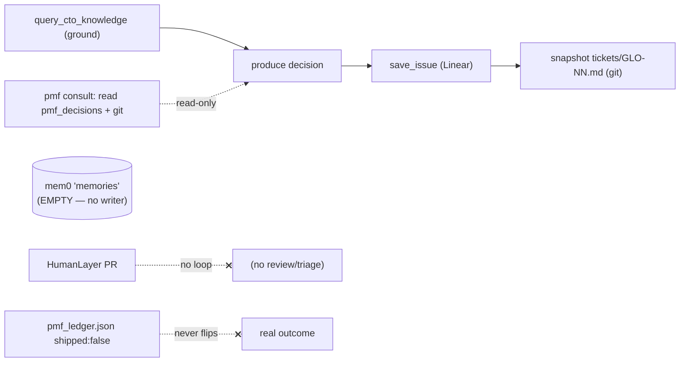
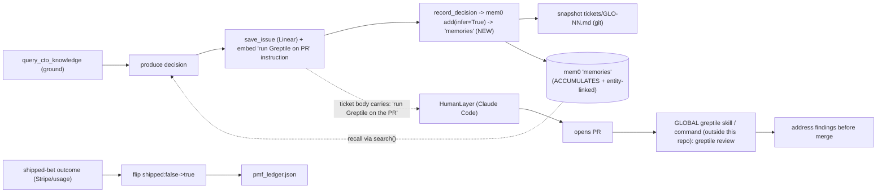

### Summary of change request

GLO-14 is the **next full-build epic** for the Sovereign CTO Stack, authored on the GLO-13 closeout. GLO-13 shipped Phases 0–5 plus the prioritized P0–P4 backlog as thin, gated, verifiable slices. GLO-14 rolls forward what remains and folds in items discovered while building P0–P4. **Scope decision (resolved): build the full epic, top-to-bottom (Q1 = Option C).** The backlog, in build order:

- **P1 (top priority, user-requested)** — Long-lived mem0 memory capture used *the way mem0 is designed*: every agent run records its decision so the `memories` collection genuinely accumulates across runs (today the loops only *read* prior decisions; nothing accumulates). Research settled the "is it plug-and-play passive?" question (see below): the self-hosted `Memory` class is **never** passive — `add()` is always explicit — so we write deterministically, but use mem0's intended `infer=True` extraction + the new native entity-linking (no Neo4j) so recall quality is "as designed." Git history stays authoritative; mem0 is a complement.
- **P2 (re-architected, then decoupled — resolved)** — Autonomous PR review via the **Greptile CLI**. The Greptile CLI + a Claude Code skill + a `/greptile` command are set up **globally and outside this project** (in the user's `~/.claude`, project-agnostic — *not* a GLO-14 repo deliverable). Hermes has **nothing** to do with Greptile except one thing: **every Linear ticket Hermes files carries a standing instruction** telling HumanLayer to run Greptile on the PR after submitting it. So the only in-repo GLO-14 work is that ticket-instruction line (+ a gate verifying it); HumanLayer-on-Claude-Code, executing the ticket, opens the PR and uses its global Greptile skill to review and address findings. No webhook, no MCP, no in-repo Greptile skill, no `query_cto_knowledge` triage step.
- **P3 (expanded)** — Not just an authenticated Chromium profile: a **fuller multi-component visual demo** that surfaces as many of the stack's components as practical, with the authenticated-Linear-UI ending as one enabling piece (local `file://` snapshot retained as the reproducible default). Component inventory + visualization map is below.
- **P4** — Host-orchestrator egress confinement via OpenShell's MicroVM driver (libkrun + Hypervisor.framework) — confines the *host Hermes orchestrator itself*, which runs outside any sandbox today. **Resolved: spike + document this cycle (Q9 = Option A).**
- **P5** — PMF → product loop: wire a real shipped-bet feedback signal so `shipped:false→true` flips from measured outcomes, computing the North Star ("opportunities shipped") from reality.
- **Part C (rolled-forward deferrals)** — mem0 OSS dashboard (deferred — Q12), OpenHands via Portal/LiteLLM, second-account walkthrough, **and now Moderne / OpenRewrite** (moved here from P6 — no account provisioned). **Part D** — author the *next* epic at closeout.

> **mem0 research verdict (authoritative, 2026).** "Does mem0 work passively / plug-and-play?" — For the OSS self-hosted `Memory` class we run: **no.** You always call `m.add()`; there is no background listener. The only "passive-feeling" path is mem0's **OpenAI-compatible proxy** (`mem0.proxy.main.Mem0`), which auto-captures *only when your LLM calls route through mem0*. Our stack routes inference through the **Nous Portal** proxy (`127.0.0.1:8645/v1`), not mem0, so passive proxy-capture is not available without re-plumbing inference. **GraphRAG-without-Neo4j is TRUE**: mem0 OSS v2.0.0 (Apr 2026) removed all external graph stores (Neo4j/Memgraph/Kuzu/AGE/Neptune) and replaced them with **built-in entity linking** that runs natively on the existing vector store with zero extra infra (it is entity-aware hybrid retrieval, not a traversable property graph). Conclusion: write deterministically with `infer=True` (mem0's intended extraction/dedup), adopt the native entity-linking upgrade, and keep git as the deterministic record.

### Current State

- The system files richly-grounded Linear tickets and snapshots them to git, but its "memory" never grows: the `memories` collection mem0 is configured to use is **empty** — only seed/test rows exist. The agent reads prior decisions but never writes new ones, so it cannot genuinely "remember what it decided and why" across runs.
- Agents ship code (file tickets, route to Codegen) but nothing reviews that code automatically — there is no PR → review → triage loop. The "review half" of an autonomous engineering factory is missing.
- The recorded demo ends on a locally-rendered HTML snapshot of the ticket (honest and reproducible) but **cannot** end on the live Linear ticket page, because the throwaway recorder browser has no Linear session and hits the auth wall. The demo also surfaces only two surfaces (a tool-call log + the coupling graph) of a stack that has many more components.
- The host orchestrator (the "brain") runs unsandboxed on the macOS host; only the containerized sub-tools are egress-confined.
- The PMF ranking carries a `shipped` flag that is always `false` — the North Star metric ("opportunities shipped") is never computed from real outcomes, only from tickets filed.

### Desired End State

- **A system that learns, using mem0 as designed.** After N agent runs, a fresh mem0 query returns prior-run decisions that were *never* seeded from `tickets/` — the `memories` collection demonstrably accumulates, run over run, with mem0's own fact-extraction/dedup and native entity linking improving recall. (Acceptance criterion #1.)
- **Agents that ship *and* review code, via the Greptile CLI.** Every ticket Hermes files instructs HumanLayer to run Greptile on the resulting PR; HumanLayer-on-Claude-Code does so with its global Greptile skill and addresses the findings before merge — no webhook server, no MCP review-trigger, no in-repo Greptile code beyond the ticket instruction.
- **A more convincing, fuller demo.** The recording visualizes more of the stack's components and *can* end on the real authenticated Linear ticket UI, with the local snapshot retained as the default.
- **Stronger confinement, honestly scoped.** Host-orchestrator MicroVM confinement is spiked and the macOS-bug tradeoffs recorded in `docs/system-design-tradeoffs.md`. (Acceptance criterion #4.)
- **A closed North Star loop.** A shipped bet's measured result flips its ledger entry to `shipped:true`, grounded in real usage + Stripe data.
- Moderne/OpenRewrite is captured as a Part C deferral (no account); each rolled-forward item states scope + rationale; on closeout the next epic is authored and snapshotted to `tickets/`. (Acceptance criteria #5, #6.)

### What we're not doing

- **Not** making mem0 a dependency. Git history stays the authoritative decision record; mem0 is a recall *complement* that must never become load-bearing for correctness (the "policy.yaml of the mind").
- **Not** building any Greptile integration *inside* this repo. No webhook receiver, no Greptile MCP, no in-repo Greptile skill, no `query_cto_knowledge` triage of findings. The Greptile CLI + Claude Code skill + `/greptile` command live **globally in the user's `~/.claude`, set up outside this project** (a separate, project-agnostic task — not a GLO-14 deliverable). The *only* GLO-14 P2 work is the standing instruction line Hermes embeds in every ticket (+ a gate). (See Resolved Q6/Q7 and D-3/D-4.)
- **Not** re-doing GLO-13 P1 (containerized sub-tool egress confinement). P4 is the *same* OpenShell/NemoClaw stack switched to the MicroVM driver to confine the host process — not a different tool.
- **Not** evaluating Moderne/OpenRewrite this epic — moved to Part C (no paid account provisioned).
- **Not** building the full mem0 OSS server + Next.js dashboard (Part C deferral — Q12 resolved: defer). No frontend exists in the repo today; a *lightweight read-only memory view* is captured only as an open demo question (Q D-2), not the full dashboard.
- **Not** building OpenHands / LiteLLM integration or the second-account walkthrough (Part C, future-only).
- **Not** auto-triggering live Codegen runs (it stays "named-only" routing as in GLO-13) unless that scope is separately requested.

### Proposed End State Architecture

**Before** — the loop reads memory but never writes it; the review/feedback loops are open:



**After** — close the write path (P1), CLI-driven review (P2), feedback loop (P5):



The dashed box (HumanLayer → PR → global Greptile skill) all happens **outside this repo**. The only GLO-14 deliverable on that path is the instruction Hermes writes into the ticket body (`F`).

**P1 — the load-bearing insertion point, identical in both loops.** Research §3 pins a single canonical position for the "record this decision" step: **after `save_issue` returns a ticket ID and before `snapshot_after_run.sh` runs** (`record_run.sh:401`; `pmf_kanban_run.sh:368`). A new `scripts/mem0_record_decision.py` writes the just-filed decision into `memories` via the canonical mem0 loop, gated by `assert_memory_accumulates.py`.

```text
# canonical mem0 usage (research: "how it's meant to work")
#   1. search() before producing  ->  inject prior decisions as context   (already done by the consult)
#   2. agent produces decision + files ticket
#   3. add() after filing          ->  mem0 extracts facts (infer=True), dedups, entity-links
record_decision(
  messages   = [{"role":"user","content": grounding_question},
                {"role":"assistant","content": ticket_title + grounded_summary}],
  user_id    = "sovereign-cto", agent_id = profile, run_id = run_id,
  infer      = True,                         # mem0 extracts/dedups — the intended path
  metadata   = {decision_id: "GLO-NN", kind, ticket_id, grounded_in[], source: "agent_run", ts},
  collection = "memories")
# git remains the deterministic record; mem0 is the recall complement.
```

**P2 — Greptile decoupled: a ticket instruction in-repo, a global skill out-of-repo.**

```text
IN-REPO (the only GLO-14 deliverable):
  Hermes' ticket-filing skills append a standing line to every ticket body, e.g.
    "After you open a PR for this ticket, run Greptile on it (/greptile) and
     address the findings before requesting merge."
  A gate asserts the line is present in newly-filed tickets.

OUT-OF-REPO (user's global ~/.claude, project-agnostic — a separate task, NOT GLO-14):
  - `greptile login` once (OAuth) so the CLI is authenticated on this host
  - a global Greptile Claude Code skill (install/adapt github.com/greptileai/skills)
  - a global `/greptile` command
  HumanLayer-on-Claude-Code, executing ANY ticket, opens a PR and uses these to run
  `greptile review` and address findings. Works for every repo, not just this one.
```

Rationale (your directive): keep Greptile entirely general-purpose and global; the sovereign-CTO repo stays clean and Hermes' sole responsibility is to *prompt* the work via the ticket. We deliberately drop the in-repo grounded-triage step (no `query_cto_knowledge` grounding, no auto-filed `[Brownfield]` follow-ups) in favor of this clean separation — Claude Code addresses Greptile's findings directly during PR execution.

### Design Questions

_All design questions resolved — see below._

### Resolved Design Questions

#### Q1 — Epic scope & sequencing → **Option C (full epic)**

Build all of P1–P5 top-to-bottom this cycle (with P6/Moderne moved to Part C and the dashboard deferred). Rationale: user directive. The original recommendation (Option B, load-bearing trio) is superseded. Options A (P1-only) and B (trio) discarded — the user wants the complete epic designed and built, not a thin slice.

#### Q2 — mem0 target collection → **Option A (unified `memories`, repoint the PMF read to it)**

Write *and* read the single `memories` collection so the system genuinely remembers and recalls from one place. Repoint `scripts/mem0_pmf_decisions.py`'s read filters/collection from `pmf_decisions` to `memories`. Rationale: only this option makes the recall convenience real (the criterion names `memories`, and a write-only collection nobody reads would be theater). Option B (two parallel memories) and Option C (write to both) discarded as duplicative/confusing.

#### Q3 — Who performs the write → **Option A (deterministic Python helper), load-bearing; Option B (Hermes-native) verified as a complement**

Research settled this: passive capture is unavailable for our architecture (inference routes through Nous Portal, not mem0's proxy), so a deterministic explicit `add()` is required and is the gate-able, guaranteed mechanism. **Complement to verify empirically during implementation:** run a loop and query `memories` to check whether the closed-source `hermes-agent` binary writes anything on its own via `mem0.json`; if it does, that's a bonus, but the deterministic helper remains load-bearing. Option C (agent-called skill) discarded — adds non-determinism to a step we want guaranteed every run.

#### Q4 — Write semantics → **`infer=True` (mem0's intended extraction), NOT `infer=False`**

Flipped from the initial recommendation based on your "use mem0 the way it's meant to work" directive and the research. mem0's designed path is `infer=True`: the extraction LLM pulls salient facts, dedups, resolves conflicts, and (on ≥v2.0.0) entity-links — which is exactly "as designed." Feed it the full agent turn (grounding question + decision). The cost (non-determinism, an Ollama LLM call on write) is acceptable **because git is the deterministic record and mem0 is only the recall complement**. Idempotency comes from mem0's own dedup rather than a search-before-add guard, but we still tag `metadata.decision_id` + `source:"agent_run"` for the gate. `infer=False` discarded for the decision-capture path (it skips the dedup/extraction that makes mem0 "work as designed," and stores `user`-role text only).

#### Q5 — Accumulation gate → **count-delta + entity/substring retrieval, tolerant of extraction**

Because `infer=True` means mem0 decides the stored phrasing, the gate cannot assert a verbatim `decision_id` string. Instead: snapshot the `source:"agent_run"` row count, run the loop, assert the count grew, and assert a `search()` for the current run's topic returns a hit carrying this run's `metadata.decision_id`. This proves "accumulated, not seeded from `tickets/`." Supersedes the earlier verbatim-ID approach.

#### Q6 / Q7 — P2 architecture → **Greptile CLI via a global Claude Code skill (webhook receiver + MCP-trigger discarded)**

Replaces the original "GitHub `pull_request` webhook → Hermes resume → Greptile MCP/`/v2` API → triage" design. Research validated the Greptile **CLI** (v3.1.1: `greptile review --json/--agent`, `greptile login`) — same review engine as the GitHub App, parseable JSON output — and confirmed Greptile **officially publishes Claude Code skills** (`github.com/greptileai/skills`). Discarded: the standalone webhook receiver, and the Greptile MCP as a review *trigger* (the MCP only exposes *completed* review data, not new reviews). **Final architecture (further refined in D-3/D-4 per your follow-up): fully decoupled.** The Greptile CLI + Claude Code skill + `/greptile` command are set up **globally in `~/.claude`, outside this repo** (project-agnostic; not a GLO-14 deliverable). Hermes' *only* involvement is a standing instruction line in every ticket it files telling HumanLayer to run Greptile on the PR. No in-repo Greptile code, no `query_cto_knowledge` triage. The GitHub App remains documented as a trivial no-code fallback. See Resolved D-3/D-4 for the detail.

#### Q9 — P4 host MicroVM confinement → **Option A (spike + document)**

Stand up the OpenShell `vm` driver, attempt to run the host orchestrator in a MicroVM far enough to hit/clear the known macOS bugs (Landlock `best_effort` no-op on XNU, mDNS `.local` non-traversal, no CUDA, case-sensitive-APFS virtio-fs), and record the tradeoffs + go/no-go in `docs/system-design-tradeoffs.md`. Satisfies acceptance criterion #4 ("scoped or built"). Option B (full default build) deferred to a later epic once the spike clears the DNS/virtio-fs risk.

#### Q11 — P6 Moderne/OpenRewrite → **Moved to Part C deferrals (no account)**

Per your directive: no Moderne account is provisioned, so the evaluation moves out of the active GLO-14 backlog into Part C's rolled-forward deferrals (alongside the mem0 dashboard, OpenHands, LiteLLM, second-account walkthrough). The acceptance criterion about piloting a recipe is therefore deferred with it; remediation continues to route to Codegen ("named-only") as in GLO-13. The OpenRewrite-OSS-pilot option is preserved in Part C for when an account/decision is made.

#### Q12 — mem0 dashboard / Part D → **Defer the dashboard; author next epic at closeout**

Defer the full mem0 OSS server + Next.js dashboard (visualization nicety; no frontend scaffolding exists). A *lightweight read-only memory view* for the demo is built instead (see Resolved D-2) and is not the deferred dashboard. Authoring the next full-build epic at closeout remains the standing, non-optional recurrence (boundary in Resolved D-6).

#### D-1 — mem0 version upgrade → **Option A (upgrade to mem0 OSS ≥ v2.0.0 for native entity-linking)**

Upgrade to a pinned, tested mem0 OSS ≥ v2.0.0 and rely on built-in entity linking (no Neo4j / no external graph DB) — this is what makes "graph logic handled natively under the hood" real for us. Low risk because we don't configure `graph_store` today (removed keys are ignored). Extend `scripts/mem0_roundtrip.py` (the existing CI smoke) to assert the new `add()/search()` return shape so the version bump is gated. Option B (stay pinned, vector-only) discarded — forgoes the capability and the "as designed" recall quality you asked for.

#### D-2 — Demo scope → **Option A montage spine + Option B lightweight memory view**

Build the curated montage of highest-signal surfaces (Telegram → graphify coupling graph → SonarQube issues → Kanban create→claim→complete → Stripe MRR/churn → RICE ledger → egress **403 refusal** → Greptile review output → authenticated Linear ticket ending) via the existing `build_showcase_video.py`, **plus** a cheap read-only mem0 memory view (static HTML, reuses the `render_*_card.py` marked.js pattern) as the visual proof that the `memories` collection grows (P1). Other components become title-carded segments. Final segment ordering to be picked together during P3 build. Option C (minimal) discarded — the whole point of P3 is to show more of the stack.

#### D-3 / D-4 — Greptile lives globally, outside the repo; Hermes only prompts the ticket → **decoupled**

Per your refinement: set up the Greptile CLI + a Claude Code skill + a `/greptile` command **globally in `~/.claude`, outside this project** (project-agnostic; a separate task, **not** a GLO-14 repo deliverable, **not** tracked in the repo, **no** in-repo grounding/triage skill). Hermes has nothing to do with Greptile except that **every Linear ticket it files carries a standing instruction** to run Greptile on the PR after submission. This supersedes the earlier D-3 recommendation (author an in-repo grounded `greptile-review` skill) and D-4 Option A (global + tracked repo copy): we now take **D-4 Option C (global-only, no repo copy)** and drop the in-repo grounding step entirely. The single in-repo GLO-14 deliverable is the ticket-instruction line that Hermes' filing skills append (`hermes/skills/file_brownfield_ticket.md`, `pmf_brief.md`), plus a gate asserting the line is present. Open micro-detail to confirm at build time: the exact wording of that instruction line (proposed: *"After you open a PR for this ticket, run Greptile on it (`/greptile`) and address the findings before requesting merge."*). Trade-off accepted: no auto-grounded `[Brownfield]` follow-ups from review findings — Claude Code addresses them inline during PR execution.

#### D-6 — Closeout boundary (Part D) → **Option A (full-epic scope substantially actioned)**

Closeout = the chosen full-epic scope (P1–P5 + the Part C capture) substantially actioned; then author the next full-build epic, rolling forward the remainder (incl. Moderne and anything discovered) and snapshotting it to `tickets/<ID>.md` (AGENTS.md rule 7). Option B (author after P1 only) discarded — premature given the full-epic decision.

#### D-5 — P5 `shipped:false→true` flip → **Option C (explicit shipped-result record + Stripe grounding)**

Confirmed after the plain-English explanation landed. "shipped" lives only in the PMF/product-strategy loop (the `cto-market` Hermes profile) — *not* mem0, *not* HumanLayer. That loop is the stack's "product manager": it RICE-ranks product **bets** in `recordings/pmf_ledger.json` and declares a North Star of **"opportunities shipped"** (success = bets actually shipped that moved a real metric, not tickets filed). Today every bet is permanently `shipped:false`. P5 wires the flip via a small `shipped_results` record (bet id + measured metric) that a deterministic reader joins to set `shipped:true`, **grounded in the real Stripe data** (`stripe_metrics.json`) so "shipped" means *measured real outcome*. Sequences after P1 (needs accumulated data). Option B (Kanban-completion) discarded — it would conflate "ticket done" with "opportunity shipped and worked," destroying the North Star distinction; Option A's Stripe delta is folded in as the grounding evidence for Option C.

### Component inventory & visualization map (for P3 / D-2)

Every component currently in the stack, and whether/how it could be shown in the demo. (Drawn from research §1–§11.)

| # | Component | What it is | Visualizable? | How to show it |
|---|---|---|---|---|
| 1 | Hermes orchestrator (2 profiles: `cto-architecture`, `cto-market`) | External `hermes-agent` brain driving both loops | ✅ already | Left-pane streaming tool-call log (`[live] tool … completed`) |
| 2 | Nous Portal inference | OpenAI-compatible proxy `127.0.0.1:8645/v1` | ⚠️ indirect | A terminal line / title card noting sovereign inference path |
| 3 | mem0 + pgvector | Memory layer (now accumulating, entity-linked) | ✅ NEW (D-2) | Tiny read-only HTML view of `memories` rows + entity links, before/after a run |
| 4 | CTO-knowledge RAG sidecar | MiniLM + LanceDB + FastMCP (`query_cto_knowledge`) | ✅ | Tool-call log lines showing multi-angle grounding + cited source files |
| 5 | Telegram gateway | Chat interface to the orchestrator | ✅ | Telegram window pane (agent receiving a prompt / replying) |
| 6 | Linear MCP + ticket snapshots | `save_issue` → `tickets/GLO-NN.md` | ✅ (P3 ending) | Authenticated Linear ticket UI as the closing shot |
| 7 | graphify (KEEP) | Service-coupling map (`graph.html`, degrees, hubs) | ✅ already | Right-pane interactive coupling graph |
| 8 | SonarQube (DETECT) | 240 real issues | ✅ | SonarQube issues view / a rendered issue card |
| 9 | `fuse_signals` | DETECT+KEEP fusion → `service-coupling.json` | ⚠️ | Title card showing the fused `static_analysis` block / `priority_score` |
| 10 | Codegen MCP | Remediation back-end (named-only routing) | ⚠️ | Ticket body line "Proposed refactor — route to Codegen" |
| 11 | NemoClaw / OpenShell egress sandbox | OPA CONNECT proxy + Landlock allow-list | ✅ strong | Terminal: non-allow-listed CONNECT → **403 refused**; allow-listed → 200 |
| 12 | Stripe client | Real MRR/churn/cohorts → `stripe_metrics.json` | ✅ | MRR/churn metric card |
| 13 | PMF Kanban (`~/.hermes/kanban.db`) | create → claim → complete lifecycle | ✅ | Kanban board state transitions |
| 14 | RICE/ICE ledger | Ranked opportunities (`pmf_ledger.json`), `shipped` flag | ✅ | Ranked table card; P5 flips a row to `shipped:true` |
| 15 | Recording pipeline | Xvfb + ffmpeg + Chromium split-screen | ✅ (is the medium) | The recording itself |
| 16 | Showcase montage builder | `build_showcase_video.py` ordered catalogue | ✅ (is the medium) | The stitched montage with title cards |
| 17 | Greptile CLI review (NEW, P2 — runs out-of-repo) | `greptile review` findings on the PR | ✅ | CLI review output pane → findings addressed in the PR |
| 18 | HumanLayer + Claude Code | The executor that ships/reviews | ⚠️ | A Claude Code session pane running the greptile-review skill |
| 19 | `assert_*.py` gate battery | Falsifiable exit-0 gates | ⚠️ | A terminal montage of gates printing `exit 0` |
| 20 | MicroVM spike (P4) | Host-orchestrator confinement spike | ⚠️ optional | Terminal showing `openshell` `vm` driver status (if it reaches a demoable state) |

Legend: ✅ = strong/ready surface, ⚠️ = possible but lower-signal or needs a title card.

### Patterns to follow

These are the existing codebase patterns the implementation should mirror.

#### Canonical mem0 usage — search-before, add-after with `infer=True` (the P1 model)

Use mem0 the intended way: the consult step already `search()`es prior decisions; the new write `add()`s the full turn with `infer=True` so mem0 extracts/dedups/entity-links. The existing writer (`mem0_pmf_decisions.py`) shows the connection/config and idempotent shape to reuse; we change `infer=False`→`True` and target `memories`. — `scripts/mem0_pmf_decisions.py:58-94,149,156,186`

```python
# existing — pmf_decisions, infer=False (raw seed of ticket snapshots)
if not mem.search(decision_id, filters={"user_id": USER_ID}):
    mem.add(text, user_id=USER_ID, infer=False,
            metadata={"decision_id": decision_id, "kind": "product_decision"})
```

```python
# proposed — scripts/mem0_record_decision.py, collection="memories", infer=True
mem.add(
    [{"role": "user", "content": grounding_question},
     {"role": "assistant", "content": f"{ticket_title}\n{grounded_summary}"}],
    user_id="sovereign-cto", agent_id=profile, run_id=run_id,
    infer=True,                                   # mem0 extracts/dedups/entity-links — as designed
    metadata={"decision_id": ticket_id, "kind": kind, "ticket_id": ticket_id,
              "grounded_in": grounded_in, "source": "agent_run", "ts": now_iso()})
```

#### Greptile is decoupled — the in-repo pattern is a ticket-instruction line (the P2 model)

The Greptile CLI + skill + command live globally in `~/.claude`, set up outside this repo (install/adapt `github.com/greptileai/skills`; `greptile login` once). **In-repo, the only pattern is Hermes appending a standing instruction to every ticket body** — mirror how the filing skills already compose the ticket body. — `hermes/skills/file_brownfield_ticket.md`, `hermes/skills/pmf_brief.md`

```text
# appended to every filed ticket body by Hermes' filing skills:
"After you open a PR for this ticket, run Greptile on it (/greptile) and
 address the findings before requesting merge."
# a gate (assert_*.py) reads back the filed ticket and asserts this line is present.
```

```bash
# OUT-OF-REPO, global (~/.claude), project-agnostic — NOT a GLO-14 deliverable:
greptile login                              # OAuth once (~/.greptile/auth.json)
greptile review --json                      # same engine as the GitHub App; exit 0 ok / 1 fail
```

#### Falsifiable exit-0 gate per slice

Every phase ships with an `assert_*.py` that exits 0 only when the slice genuinely works (e.g. `assert_pmf_ranked.py:124-143` checks `prior_decisions_consulted.mem0_hits`). P1 needs `assert_memory_accumulates.py`; P2 needs only a gate asserting newly-filed tickets carry the Greptile instruction line (the review itself runs out-of-repo). — `scripts/assert_*.py`

```python
# P1 gate: snapshot -> act -> assert delta (tolerant of infer=True phrasing)
before = count(collection="memories", filters={"source": "agent_run"})
run_loop()
after  = count(collection="memories", filters={"source": "agent_run"})
hit    = mem.search(this_run_topic, filters={"user_id": "sovereign-cto"})
assert after > before and any(h["metadata"]["decision_id"] == this_run_id for h in hit["results"])
```

#### One-shot Hermes invocation as the run unit

Loops launch Hermes fresh per run; any new Hermes-driven step reuses the same shape rather than inventing a resume protocol. — `scripts/record_run.sh:301`, `scripts/pmf_kanban_run.sh:297`

```bash
hermes -p cto-architecture -z "…" | tee recordings/agent_hero_${ts}.log
```

#### Additive, atomic JSON augmentation

`fuse_signals.py` augments `service-coupling.json` without overwriting upstream keys, writing atomically via `os.replace`. The P5 `shipped` flip and any artifact edits follow this (never clobber, atomic write). — `scripts/fuse_signals.py:147-152`

```python
data["static_analysis"] = fused          # additive key, preserves graphify's own keys
tmp = path + ".tmp"; json.dump(data, open(tmp, "w")); os.replace(tmp, path)   # atomic
```

#### Egress allow-list as deny-by-default contract

The sandbox confines containerized sub-tools; any *new in-repo* external endpoint joins `egress/policy.yaml`'s allow-list with `enforcement: enforce`, and the negative test (non-allow-listed CONNECT → 403) stays load-bearing. Note: Greptile now runs in HumanLayer/Claude Code on the host (outside the sandbox), so it is **not** an in-repo egress concern. — `egress/policy.yaml:53-125`

#### Ground-before-act, then snapshot

Both loops call multi-angle `query_cto_knowledge` before any CTO function and snapshot the ticket to git after — the P1 write sits between filing and snapshot, and the P2 instruction line is appended during ticket composition. — `hermes/AGENTS.md:10-13`, `hermes/skills/file_brownfield_ticket.md:46-69`

#### Card-render pattern for new visual surfaces (P3 / D-2 memory view)

The recorder renders markdown/JSON to HTML via a marked.js template and screenshots it. A lightweight read-only mem0 memory view reuses this exact pattern. — `scripts/render_ticket_card.py:51-107`, `scripts/render_title_card.py`

```python
# reuse: scan source -> embed in HTML template (marked.js CDN) -> write recordings/<name>_<ts>.html
# new: render the memories collection rows + entity links the same way
```
